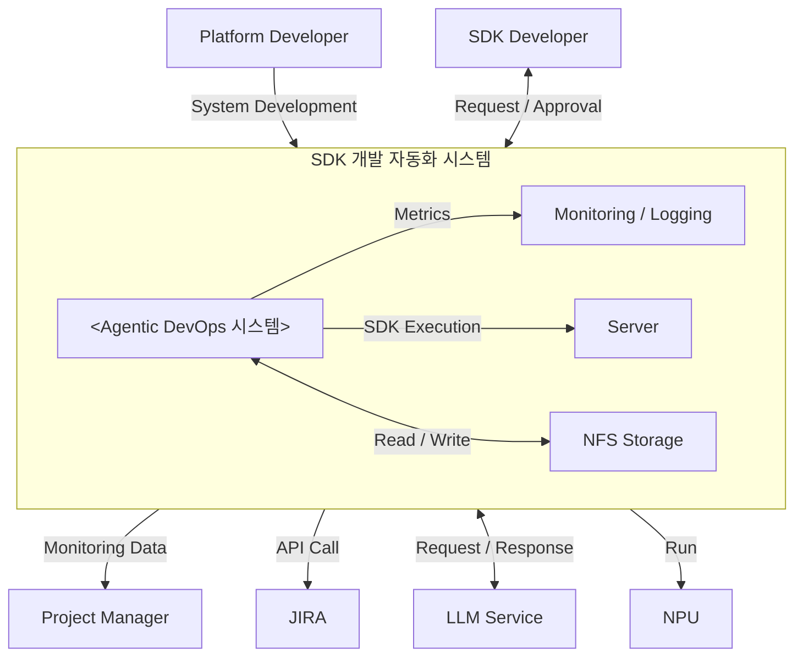

# Context Diagram (시스템 경계)

> category: artifact | source: pptx p.14 | updated: 2026-06-20
> 시스템 경계 = `SDK 개발 자동화 시스템` (내부 = Agentic DevOps 시스템 + Monitoring/Logging + Server + NFS Storage)

## 외부 엔티티 관계
| 외부 엔티티 | 관계(방향) |
|---|---|
| Platform Developer | System Development (→) |
| SDK Developer | Request / Approval (↔) |
| Project Manager | Monitoring Data (←) |
| JIRA | API Call (→) |
| LLM Service | Request / Response (↔) |
| NPU | Run (←) |
