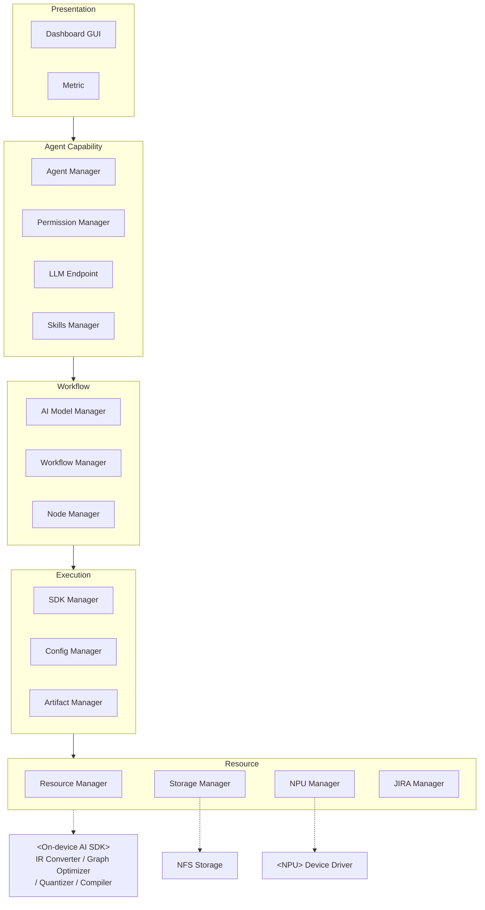

# Domain Diagram (컴포넌트 레이어)

> category: artifact | source: pptx p.15·16 (vs 35·36) | updated: 2026-06-20
> ⚠️ 2개 버전 공존 — JIRA Manager 위치 등 상이. 최신본 확정 필요 (open-issues OI-5). 아래는 슬라이드 15·16 기준 잠정.

`<Agentic DevOps 시스템>` 5계층:

## 레이어 정리
| 레이어 | 컴포넌트 |
|---|---|
| Presentation | Dashboard GUI, Metric |
| Agent Capability | Agent Manager, Permission Manager, LLM Endpoint, Skills Manager |
| Workflow | AI Model Manager, Workflow Manager, Node Manager |
| Execution | SDK Manager, Config Manager, Artifact Manager |
| Resource | Resource Manager, Storage Manager, NPU Manager, JIRA Manager |

외부: `<On-device AI SDK>`(IR Converter / Graph Optimizer / Quantizer / Compiler), `<NPU>`(Device Driver), NFS Storage
