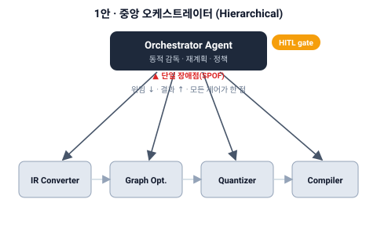
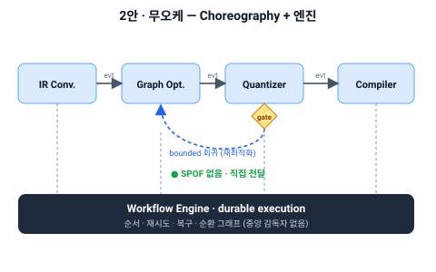
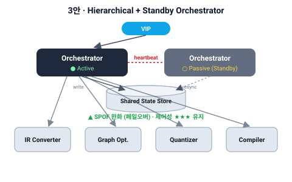

# DP-01 제어성과 가용성을 고려한 에이전트 오케스트레이션 설계 (Agent Orchestration)

> category: DP | status: 결정대기 (구 DP-0001/0002 대체 — 2026-06-27 삭제 완료) | source: pptx p.30 재구성 | updated: 2026-06-27
> drives: QA-03(Controllability)↑, QA-02(Availability), QA-01(Scalability)
> realizes: FR-0004 | constrained-by: C-02(기존 시스템 무영향)
> 재구성 note: 기존 DP-0001(배치)+DP-0002(위상)를 **직교 2결정으로 분리** — 본 **DP-01 = 제어평면(오케스트레이터 有無)**, 짝 **DP-02 = Agent 특화 표면**. **2026-06-27 구 DP-0001/0002 삭제(대체 완료)**: DP-0002(위상·Standby)는 본 DP-01로 승계, 구 DP-0001(배치/풀) 결정은 재귀속 보류(OI-12), DP-02(특화)는 드랍(`discussion/dp/notes/dp2-drop-rationale.md`). 근거: `discussion/dp/notes/agent-basics-and-dp1-retrospective.md`.

---

## 용어 (먼저 읽기 — 이 결정에서 쓰는 표현)

| 용어 | 뜻 |
|---|---|
| **Orchestrator (오케스트레이터)** | 전체 흐름을 **중앙에서 감독·지시**하는 LLM 에이전트 — 노드에 작업 위임, 실패 시 재계획, 정책·승인 적용 |
| **Orchestration ↔ Choreography** (오케스트레이션 ↔ **코리오그래피**) | **오케스트라(지휘자가 지시)** 처럼 제어를 **중앙 1점**에 두면 orchestration / **안무(무용수가 각자 동작을 알고 음악·서로에 반응)** 처럼 각 단계가 **이벤트로 자율 협력**하면 choreography. *Choreography = 무용의 "안무"에서 온 말* |
| **Workflow Engine (durable 워크플로 엔진)** | 워크플로의 순서·재시도·복구를 책임지되, **실행 상태를 단계마다 외부에 영속화(event sourcing)해 프로세스가 죽어도 새 워커가 그 기록을 재생(replay)하여 멈춘 단계부터 손실 없이 이어 실행(exactly-once 효과)** 하는 런타임. 비유: *자동 저장되는 게임* — 전원이 나가도 죽은 지점에서 재개. **LLM 감독자가 아니다**(추론·재계획 안 함) — 1안 Orchestrator와 구분되는 *상태·내구를 책임지는 인프라 계층* |
| **라우팅 ↔ 오케스트레이션** | "어느 노드로 보낼까"(라우팅)는 고정 파이프라인이면 *배선이 답* / "다음에 뭘 할지 추론"(오케스트레이션)은 흐름이 *동적*일 때만 필요 |
| **HITL gate** | Human-In-The-Loop — 고위험 액션을 **사람 승인**으로 거르는 지점 |
| **SPOF** | Single Point of Failure(단일 장애점) — 그것이 죽으면 전체가 멈추는 지점 |
| **Active-Passive / Standby (이중화)** | 같은 오케스트레이터를 2개 두되 1개만 활성(Active), 1개는 대기(Passive). 활성이 죽으면 대기가 승격 = **failover**. *주의: 대기분은 부하를 받지 않으므로(≠Active-Active) 가용성만 오르고 확장(QA-01)은 그대로* |
| **heartbeat** | 활성 노드 생존을 주기적으로 확인하는 신호 — 끊기면 페일오버 발동 |
| **상태 외부화 / VIP** | 오케스트레이터 상태를 외부 저장소에 둬 페일오버 시 이어받게 함 / VIP=가상 IP, 요청을 활성 노드로 자동 라우팅 |
| **stateless judge gate** | 단계 출력의 통과/실패를 판정하는 **일회용** 판정자(상주 감독자 아님) |
| **bounded ↔ open-ended 회귀** | 고정된 회복 엣지(예: Quant 실패→Opt)는 *bounded*(엔진이 처리) / 회복 행동을 추론으로 *생성*하면 *open-ended*(오케스트레이터 필요) |
| **ASR / driving QA** | ASR=아키텍처 핵심 요구(목록·우선순위 SSoT: [`context/asr.md`](../../asr.md)) / driving QA=이 결정이 좌우하는 주 품질속성 |
| **★ 등급 · S·T·R·N** | ★=그 QA 만족도(등급척도 앵커) · S 민감점 · T 교환점 · R 위험 · N 비위험(ATAM) |

---

## 슬라이드 요약 (1장 — 16:9)

**결정 포인트**: Agent 제어를 **중앙 오케스트레이터(동적 감독)** vs **분산(choreography)+워크플로 엔진** 중 어디에 둘 것인가 — 제어성 ↔ 가용성 교환. **(발표 1번 타자: 두 H-ASR 교환점 + "자율인데 통제 가능한가" 명제를 여는 결정.)**

> 대안별 column = (a) 도안 + (b) 설명 + (c) 별점(행=ASR). 도안 SVG: `diagrams/`.

| | **1안 · 중앙 오케스트레이터 Agent** | **2안 · 엔진 기반 워크플로 (Choreography)** | **3안 · 중앙 오케스트레이터 Agent 이중화 (Active-Passive)** (강화·승격) |
|---|---|---|---|
| **(a) 도안** |  |  |  |
| **(b) 설명** | **구조**: Orchestrator(LLM 감독자)가 노드에 작업을 위임하고, 실패하면 동적으로 재계획하며, 고위험 액션은 **HITL 승인**으로 거르고 교차 정책을 **한 점에서** 집행한다. **＋** 정책과 HITL을 단일 지점에서 일관되게 적용할 수 있고, 실패 시 *open-ended* 적응 재계획이 가능하다. **－** 제어가 한 점에 집중되어 오케스트레이터가 죽으면 전체가 멈추며(**SPOF**), 모든 실행 흐름이 오케스트레이터를 경유하므로 hop 병목이 생긴다. | **구조**: 고정 파이프라인(IR→Opt→Quant→Compile)을 **durable 엔진**의 (순환) 그래프로 배선하고, 단계 사이는 **이벤트 choreography**로 자율 전달하며, 게이트는 **stateless judge**나 결정적 메트릭이 판정한다. **＋** 중앙 제어점이 없어 **SPOF와 장애 전파가 없고**, 단계 간 직접 전달로 hop이 최소화된다. **－** 교차 정책과 HITL이 분산되어 일관 적용이 어렵고, 회복이 미리 그린 엣지로 한정되어(*bounded*만) open-ended 재계획은 불가하다. | **구조**: 1안 구조를 그대로 두되 Orchestrator를 **Active-Passive로 이중화**하고, 상태를 외부화(heartbeat 감시·state resync·VIP)하여 활성이 죽으면 대기가 승격한다(**failover**). **＋** 1안의 제어성을 유지하면서 **SPOF를 완화**하여 Availability가 ★★☆에서 ★★★로 오른다. **－** 대기 인스턴스의 상시 비용(QA-13), 페일오버 중 in-flight 일관성(QA-11 손실=0 과제), 복잡도 증가가 따른다. |
| **(c) QA-03 Controllability** | ★★★ | ★★☆ | ★★★ |
| **(c) QA-02 Availability** | ★★☆ | ★★★ | ★★★ ◯ |
| **(c) QA-01 Scalability** | ★★☆ | ★★★ | ★★☆ |

> ★ 앵커: Ctrl ★★★ = ack≤5초 AND graceful stop+롤백≤30초(QA-03) · Avail ★★★ = 재기동≤4분 AND in-flight 손실=0(QA-02). **3안 Avail ★★★◯** = Standby tactic 가정(페일오버 손실=0 PoC 확정 전 `◯`).

**권고**: 자율 이슈처리(open-ended 재계획·HITL)가 binding이면 **1안 기반 + 3안(Standby)으로 강화·승격**, **DP-04와 제어평면 단일 결정**(이중 제어평면 금지). *bounded 회귀만* 필요하면 **2안**도 유효 — **드라이버로 택일**. (상세 → Appendix.)

---

## Appendix

### A1. 결정의 핵심 — "오케스트레이터는 공짜 선이 아니다"
청중이 흔히 "오케스트레이터 있으면 다 쓰지"라 묻는데, 두 혼동에서 온다:
- **라우팅(dispatch) ≠ 오케스트레이션(동적 감독)**: "어느 노드로 보낼까"는 **고정 파이프라인(IR→Opt→Quant→Compile)에선 배선(DAG)이 답** — 엔진/choreography가 한다. 오케스트레이터 *판단* 불요.
- **오케스트레이터 에이전트 ≠ 워크플로 엔진**: 순서·재시도·복구·내구는 **엔진(→ DP-04)** 몫. 오케스트레이터 에이전트는 LLM 감독자.
- 따라서 오케스트레이터는 **동적 제어(실패 시 적응 재계획·조건 분기·HITL·교차 정책)가 binding일 때만** 값. 아니면 순비용(SPOF·hop) → "다 쓰지"가 자명하지 않은 이유(= 본 DP 교환점).

**결정 드라이버 (택일 단일 질문)**
> **"자율 이슈처리(실패 시 *open-ended* 적응 재계획 · HITL 게이트 · 교차 정책)가 binding한가?"**
> - **binding → 중앙 오케스트레이터(1안/3안)** — SPOF는 Standby로 완화.
> - **아니다(고정 happy-path + *bounded* 회귀로 충분) → Choreography(2안)** — durable 엔진+choreography.

### A2. 후보 대안 (전문)
**1안. 중앙 오케스트레이터 Agent (Hierarchical)** — 구조: Orchestrator가 노드 위임·재계획·HITL gate·정책 집행. tactic: Orchestration, Centralized PEP, HITL gate. 장점 [Controllability] 단일 정책·HITL / open-ended 재계획. 단점 [Availability] SPOF / [Performance] 경유 병목.

**2안. Durable 엔진 기반 워크플로 (Choreography)** — 구조: 고정 파이프라인을 durable 엔진의 (순환) 그래프로, 단계 간 이벤트 choreography, 게이트 판정은 stateless judge/결정적 메트릭. tactic: Choreography, Durable execution, Stateless judge gate, Event sourcing. 장점 [Availability] SPOF 없음·무전파 / [Performance] 직접 전달. 단점 [Controllability] 교차 정책·HITL 분산 → 일관 적용 어려움 / 동적 재계획이 미리 그린 엣지로 제한(open-ended 불가).

**3안. Hierarchical + Standby (강화·고도화)** — 구조: 1안 + Orchestrator Active-Passive 이중화, 상태 외부화(heartbeat·state resync·VIP). 근거 tactic: Redundancy(Active-Passive)+Heartbeat — 1안 SPOF 강화. 별 변화: 1안 Availability ★★☆ → ★★★. 자기 trade-off: 대기 인스턴스(QA-13)·페일오버 일관성(QA-11 손실=0)·복잡도↑.

### A3. 대안 × ASR 통합 매트릭스 (★ + S/T/R/N)
| 대안 | QA-03 Controllability | QA-02 Availability | QA-01 Scalability |
|---|:---:|:---:|:---:|
| 1안 중앙 오케스트레이터 Agent | ★★★ (S,T) | ★★☆ (S,T,R) | ★★☆ (N) |
| 2안 엔진 기반 워크플로 (Choreography) | ★★☆ (T,R) | ★★★ (N) | ★★★ (N) |
| **3안 이중화(Active-Passive)** ✅ | ★★★ (S,T) | ★★★◯ (S,R) | ★★☆ (N) |

> 선택안(3안 권고 시)의 행이 **세트 Traceability Matrix(Reviewer §5)** 로 graduate. S=민감점·T=교환점·R=위험·N=비위험.

### A4. 대안 고도화 (비선택안도 tactic으로 강화)
- **2안 Choreography Controllability(★★☆) 강화**: 분산 정책 → **중앙 PEP + policy-as-code**로 ★★★ 근접. *그러나* open-ended 재계획은 여전히 불가 → 자율 이슈처리가 binding이면 1/3안 대비 잔여 열위로 미채택.
- **1안 Availability(★★☆) 강화**: Standby tactic → **3안(★★★) 역전 → 승격**(구 DP-0002 3안 사례 계승).

### A5. ATAM 분석
**민감점** — SP-1(제어 집중도→QA-03 ack≤5s·graceful≤30s) · SP-2(Orchestrator 가용성→QA-02 재기동≤4분·손실=0) · SP-3(흐름 동적성→오케스트레이터 정당성, 드라이버).
**교환점** — **TP-1 (Controllability ↔ Availability)** 본 DP 핵심(두 H-ASR) · TP-2 (Performance ↔ Controllability, 오케스트레이터 경유 병목).
**위험** — R-1(1안 SPOF→QA-02 미달, 3안으로 완화) · R-2(2안 분산정책→QA-03 일관 실패 + open-ended 재계획 불가 = 자율 이슈처리 FR 미충족 위험) · R-3(3안 페일오버 중 손실/일관성 QA-11 → 손실=0 PoC).
**비위험** — NR-1(Choreography 2안도 bounded 회귀는 엔진 순환 그래프+게이트로 충족 — 2안 strawman 아님).

### A6. Cohesion (DP 간 보완·연결)
- **DP-04(실행구조)와 동시결정**: 제어평면(1안=Orchestration / 2안=Choreography)은 DP-04 축B(A6 vs A3)와 **단일화 — 이중 제어평면 금지**. → 함께 결정.
- **1안 SPOF 보완**: R-1의 SPOF는 본 DP 3안(Standby) + **DP-04 durable 엔진(체크포인트·replay)** 으로 이중 보완 → "1안은 가용성 열위지만 세트 차원에서 닫힌다".
- **DP-02(특화)와 value interaction**: 특화 워커 + 정적 파이프라인이면 오케스트레이터 *라우팅* 일↓ → 오케스트레이터 정당성은 *동적 제어 드라이버*에서만.

### A7. 별점 앵커 근거 (레퍼런스)
- Orchestration/Choreography 제어 위치·트레이드오프: [api7](https://api7.ai/blog/service-orchestration-vs-service-choreography) · [Camunda](https://camunda.com/blog/2023/02/orchestration-vs-choreography/) · 멀티에이전트 orchestrator-workers: [kore.ai](https://www.kore.ai/blog/choosing-the-right-orchestration-pattern-for-multi-agent-systems)
- Active-Passive 페일오버·heartbeat·상태 동기화·VIP: [GeeksforGeeks](https://www.geeksforgeeks.org/system-design/active-passive-active-active-architecture-for-high-availability-system/) · [Aerospike](https://aerospike.com/blog/understanding-failover-mechanisms/)
- 별점 수치는 PoC로 확정(레퍼런스 수치 복제 금지). QA-02/03 등급척도 = `context/qa/QA-02·QA-03`.
