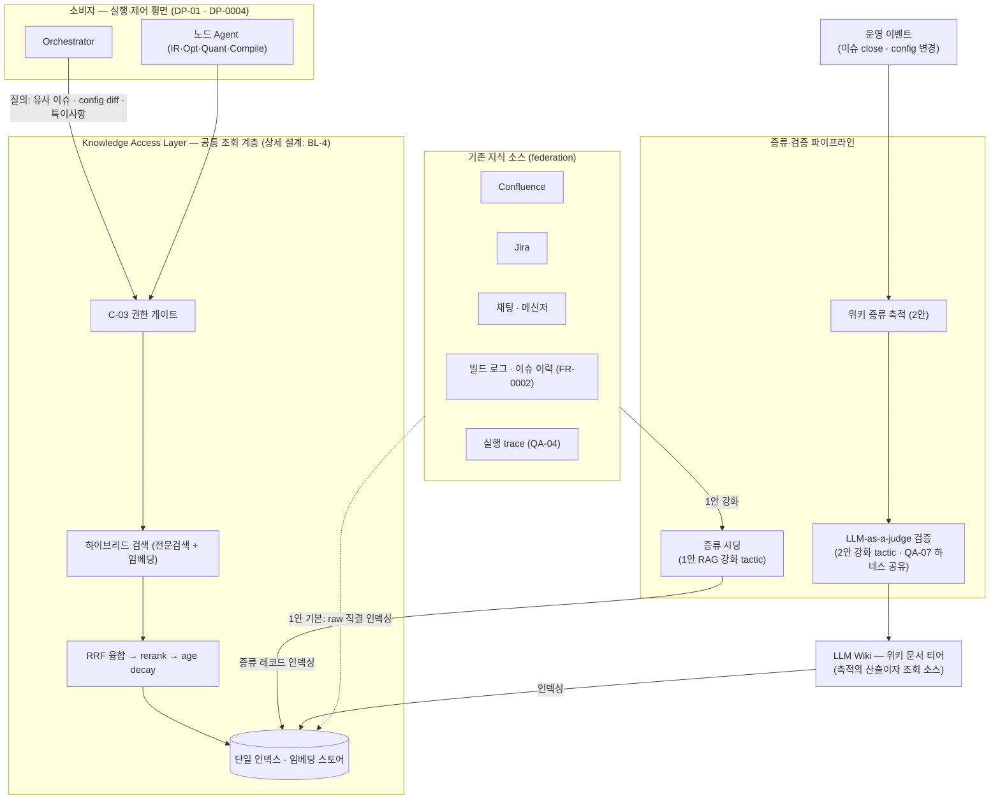

# DP-06 Agent 지식 베이스 설계 (Knowledge Base) — RAG vs LLM Wiki

> category: DP | status: 초안 v3.1 (2026-08-10 평가 기준 보강 — 팀 검토 대기) | source: 신규 발굴 (자율 이슈처리 서사의 지식 공급 공백) + 필드 레퍼런스(Cerebras Knowledge) | updated: 2026-08-10
> drives: QA-07(Correctness)↑, QA-05(Efficiency) | 평가 보강: **KB-DQ**(지식 데이터 품질 — ISO/IEC 25012 앵커: 커버리지·신선도·축적 속도, §지식 품질 평가 기준)
> realizes: FR-0003(Regression 관리의 지식 축), FR-0004(이슈처리 근거 추적) | constrained-by: C-03(지식 접근도 권한 게이트 통과)
> **재프레이밍 이력**: v1(2026-08-10) "RAG vs LLM Wiki" 형태 비교 → **v2(같은 날 디스커션)** 인덱싱·조회 계층은 공통 전제임을 확인, 결정 축을 부트스트랩 전략(Backfill/Forward/Distill-seeded)으로 전환 → **v3(같은 날 발표 용어 정비)** 청중이 아는 이름으로 복원: 대안은 **1안 RAG / 2안 LLM 위키** 2개로 단순화하고, v2의 3안(증류 시딩)은 **1안의 강화 tactic**으로, **LLM-as-a-judge**(QA-07 채택 기법)를 **2안의 강화 tactic**으로 재배치. "어디서 시작하나"(콜드스타트) 관점은 비교의 렌즈로 유지 → **v3.1(같은 날 평가 기준 보강)** 기존 ASR 중 실제로 물리는 건 QA-07·QA-05뿐임을 확인, **QA-01 행 제거** — 그 관점(축적·확장)은 지식 **데이터** 품질 기준 **KB-DQ**(ISO/IEC 25012 앵커: 커버리지 Completeness·신선도 Currentness·축적 속도)로 이관·신설(§지식 품질 평가 기준). 미결정 트래킹: open-issues OI-13.

---

## 용어 (먼저 읽기 — 이 결정에서 쓰는 표현)

| 용어 | 뜻 |
|---|---|
| **지식 베이스 (Knowledge Base)** | Agent가 판단(불량 분석·회귀 선별 등)에 필요한 **조직 지식**(과거 이슈·config 변경 이력·모델별 특이사항·툴체인 제약)을 저장하고 **선별 공급**하는 계층. raw 산출물 저장소(FR-0002)와 구분 — KB는 그 **위의 조회·증류 계층** |
| **RAG** (Retrieval-Augmented Generation) | 기존 소스(Confluence·Jira·채팅·로그)를 인덱싱해 두고, **질의 시점에 검색한 조각을 프롬프트에 넣어주는** 방식. 보통 임베딩 기반 벡터 검색 |
| **LLM 위키 (LLM Wiki)** | Agent(LLM)가 경험을 **위키 문서로 정리·갱신**해 두고, 다른 Agent가 그 문서를 읽는 방식 — 이슈 close 시 postmortem, config 변경 시 영향 요약을 축적. *사람 위키의 Agent판: 쓰는 쪽도 읽는 쪽도 Agent, 사람은 감사(audit) 가능* |
| **증류 (distillation)** | raw 데이터에서 LLM이 **질문·요약·해결책·관련 시스템만 추려 구조화 레코드로 정제**하는 것 |
| **증류 시딩 (1안 강화 tactic)** | 기존 소스를 raw 그대로 인덱싱하지 않고 **증류를 거쳐 인덱싱**하는 것 — Cerebras *thread distillation*의 적용(A7). raw 오염(garbage-in)·토큰 낭비를 원천에서 완화 |
| **LLM-as-a-judge (2안 강화 tactic)** | 별도 LLM 판정자가 산출물을 채점·검증하는 기법. **QA-07이 이미 채택**(golden 채점) — 위키 등재·갱신 전 judge가 검증해 오염을 막는다. 신뢰 조건 = **judge↔인간 일치도 κ ≥ 0.8 선검증**(QA-07 등급 척도와 동일 조건, 하네스 공유) |
| **조회 계층 (retrieval layer)** | 인덱스+검색으로 "원하는 지식을 찾아주는" 공통 인프라. **어느 대안이든 필수 — 본 DP의 비교 축이 아니라 공통 전제** (아래 §공통 전제) |
| **하이브리드 검색 / RRF / rerank / age decay** | 임베딩(의미 유사)+전문검색(에러 코드·플래그명 정확 일치)의 복수 신호 융합 / 순위 융합 / 재정렬 / **신선한 지식이 낡은 지식을 랭킹에서 이기게** 하는 시간 감쇠(staleness를 랭킹에서 완화) |
| **콜드스타트** | 지식 베이스가 **비어 있는 상태에서 시작**하는 문제. 2안의 고유 약점(1안은 기존 소스로 즉시 커버) |
| **garbage-in** | 저품질 소스를 그대로 인덱싱하면 검색이 **오염된 근거를 공급** — grounding이 오히려 오진을 부르는 함정 (1안 기본형 리스크 → 증류 시딩으로 완화) |
| **grounding / hallucination** | grounding = LLM 답을 실제 근거 데이터에 붙들어 매는 것 / hallucination = 근거 없이 지어내는 것. 사내 SDK·NPU 도메인은 학습 데이터에 없어 grounding 없이는 hallucination이 기본값 |
| **staleness (낡음)** | 저장된 지식이 갱신을 못 따라가 현실과 어긋난 상태. 위키 문서·임베딩 인덱스 모두에 있다(재인덱싱 랙) — 정도 차이 |
| **prompt cache 적합성** | 안정된 위키 문서는 반복 조회 시 prompt caching(QA-05 — 캐시 read ~10% 가격) 적중률이 오른다. 질의마다 조합이 바뀌는 raw top-k는 캐시 비친화 |
| **KB-DQ / ISO·IEC 25012** | KB-DQ=본 DP 전용 **지식 데이터 품질 평가 기준**(커버리지·신선도·축적 속도 — §지식 품질 평가 기준). 앵커 표준 = **ISO/IEC 25012 Data Quality Model**(우리 QA 앵커인 25010과 같은 SQuaRE 패밀리 — 25010은 시스템, 25012는 데이터) |
| **RAGAS / context recall** | RAG 평가 필드 표준 프레임워크 / context recall=질의에 필요한 근거가 실제로 회수된 비율(커버리지 측정), faithfulness=답이 근거를 이탈하지 않는 정도 |
| **ASR / driving QA** | ASR=아키텍처 핵심 요구(목록·우선순위 SSoT: [`context/asr.md`](../asr.md)) / driving QA=이 결정이 좌우하는 주 품질속성 |
| **★ 등급 · S·T·R·N** | ★=그 QA 만족도(등급척도 앵커) · S 민감점 · T 교환점 · R 위험 · N 비위험(ATAM) |

---

## 공통 전제 — 조회 계층 (본 DP의 비교 축 아님, 채택 패턴)

> **어느 대안을 고르든 인덱싱·조회 계층은 필요하다.** 형태(raw/위키)가 달라도 "인덱스가 있어야 원하는 지식을 찾는다"는 점은 동일 — 따라서 조회 계층은 대안 간 변별 축이 아니라 **공통 전제**로 깔고, 필드 수렴 패턴을 채택한다.

**채택 패턴 (레퍼런스 아키텍처 = Cerebras Knowledge, A7)**: 모든 소스를 **단일 임베딩 스토어**로 연합 + **하이브리드 검색**(전문검색: 에러 코드·플래그명 정확 일치 / 임베딩: 패러프레이즈) + **RRF 융합 → rerank** + **age decay**(신선한 지식 우선). 우리 도메인(빌드 로그·config diff·quantize 플래그)은 정확 문자열 검색 수요가 커서 하이브리드가 옵션이 아니라 필수. **상세 설계(신호 구성·인덱스 기술 선택)는 `_backlog.md` BL-4** — 본 DP 확정 후 후속 결정. 구조도는 슬라이드 2 참조.

---

## 지식 품질 평가 기준 (KB-DQ) — ISO/IEC 25012 앵커

> **왜 별도 기준인가**: 기존 ASR 중 본 DP에 실제로 물릴 수 있는 건 **QA-07(정확성)·QA-05(토큰 효율)** 뿐이다. 커버리지·신선도·축적 속도는 시스템 품질속성이 아니라 **"Agent에게 공급되는 데이터의 품질"** — 시스템 품질은 ISO/IEC 25010(우리 QA 앵커)이 맡지만, **데이터 품질은 같은 SQuaRE 패밀리의 ISO/IEC 25012(Data Quality Model)** 가 표준이다. 25012는 데이터 자체로 평가하는 **고유(inherent) 특성** 5개(Accuracy·**Completeness(완전성)**·Consistency·Credibility·**Currentness(최신성)**)를 정의 — 커버리지·신선도가 정확히 이 자리다. 측정은 RAG 필드 표준 **RAGAS**(context recall/precision·faithfulness)를 쓴다. 25010(시스템)과 25012(데이터)를 나란히 쓰는 것은 SQuaRE 패밀리 내 정합.

| KB-DQ 기준 | ISO/IEC 25012 앵커 | 정의 | 측정 (예시 KPI — PoC로 확정) |
|---|---|---|---|
| **KB-DQ-1 커버리지** | **Completeness** (고유) | 질의가 요구하는 지식이 KB에 존재·회수되는 정도 | golden 질의셋 대비 **context recall**(RAGAS) + 미회수(no-evidence)율 |
| **KB-DQ-2 신선도** | **Currentness** (고유) | 지식이 원본 현실을 반영하는 최신성 | 소스 변경 → 조회 반영 랙 p95 + **stale-hit율**(낡은 근거의 top-k 진입 비율) |
| **KB-DQ-3 축적 속도** | (25012 직접 특성 아님 — Currentness의 운영 파생) | 새 지식이 조회 가능해지기까지의 속도 = **콜드스타트 탈출 속도** | 이벤트 발생 → 조회 가능 **time-to-knowledge** p95 + 주당 신규 지식 항목 수 |
| *(재사용)* 정확성 | 25012 **Accuracy**와 접점 — 측정은 **QA-07에 위임** | 회수 근거·생성 답의 옳음 | QA-07 golden 정답률(재정의 금지) + RAGAS **faithfulness**(근거 이탈 없는 생성) |
| *(재사용)* 토큰 효율 | (25012 밖 — 시스템 측) **QA-05에 위임** | 조회가 소비하는 신규 토큰 | QA-05 신규 토큰 캡 · 캐시 분리집계 |

- **검색 품질(context precision — 잡음 없는 회수)** 은 대안 변별이 아니라 공통 조회 계층의 품질 → **BL-4 평가 지표**로 이관.
- **위상**: KB-DQ는 현재 **DP-06-로컬 평가 기준**(별점 보조 매트릭스) — QA(전사 품질속성)로의 승격 여부는 팀 디스커션(OI-13). 수치는 전부 예시값, PoC로 확정.

---

## 슬라이드 요약 (본편 3장 + Appendix 1장 — 16:9)

### 슬라이드 1 — 왜 지식 베이스인가 (필요성)

**결정 포인트**: Agent가 불량 분석·회귀를 수행하려면 조직 지식에 접근할 수 있어야 한다. 조회 계층은 공통 전제 — 그 위에 **지식을 어떤 방식으로 채우고 공급할 것인가: RAG인가, LLM 위키인가.**

**필요성 3축** (사람이 하던 일을 Agent가 하려면 사람이 쓰던 지식이 필요하다):

| 축 | 문제 | 지식 베이스가 닫는 것 |
|---|---|---|
| **① 자율 이슈처리의 전제** | 불량 분석(failure triage)·회귀(regression) 선별은 **과거 유사 이슈·직전 config 변경·모델별 특이사항** 없이는 판단 자체가 불가능. 사람 엔지니어는 이 지식을 머리·위키·채팅에 갖고 있었다 — Agent에게는 공급 경로가 **없다** (Pain Point: 개인별 config 관리, Jira 대신 채팅 우회 → 지식 휘발) | 흩어진 조직 지식을 Agent가 **조회 가능한 형태**로 집약 → FR-0003(변경 추적·Regression), FR-0004(이슈처리 근거) |
| **② LLM 파라미터 지식의 한계** | 사내 SDK 파이프라인·NPU 툴체인·모델 조합은 **학습 데이터에 없다**(비공개+컷오프) → grounding 없이는 hallucination이 기본값. "일관되게 틀린" 분석은 rework 폭증(QA-07이 경고하는 바로 그 경로) | 판단을 **실제 근거(이슈 이력·로그·config diff)에 grounding** → QA-07 golden 정답률의 전제 |
| **③ 컨텍스트 윈도·토큰 한계** | 빌드 로그·20GB+ 산출물·전체 이슈 이력을 프롬프트에 다 넣을 수 없고, 욱여넣을수록 신규 토큰 캡(QA-05: ≤6k/8k) 위반 + 비용 폭증 | **필요한 지식만 선별 공급**하는 조회·증류 계층 → QA-05 신규 토큰 캡 안에서 grounding 성립 |

**동작 예시 (한 줄 서사)**: 불량 발생 → Agent가 *유사 과거 이슈 + 직전 config diff + 해당 모델 특이사항*을 지식 베이스에서 조회 → 원인 가설 수립 → 영향 범위 기반 회귀 세트 선별 실행 → 처리 결과가 다시 지식으로 축적(선순환).

> 요지: 지식 베이스는 "있으면 좋은 것"이 아니라 **자율 이슈처리의 성립 조건**이다. 그리고 지금 그 지식 베이스는 **비어 있다** — 기존 Confluence·Jira 연동 RAG도, LLM 위키도 없다. 다음 장에서 구조와 방식을 결정한다.

### 슬라이드 2 — 공통 조회 계층 구조: 하나의 인덱스, 여러 지식 소스

**메시지**: LLM 위키든 기존 Confluence·Jira·채팅이든, 모든 지식 소스는 **하나의 조회 계층(단일 인덱스) 아래에 federation으로 붙는다.** 본 DP의 결정(슬라이드 3)은 이 구조에서 "지식을 어떤 방식으로 채우나" — 인덱싱 경로의 선택이다.

**구조 읽기**
- **소비자**(Orchestrator·노드 Agent)는 **C-03 권한 게이트**를 지나 조회 계층에만 질의 — 소스에 직접 접근하지 않는다(단일 진입점).
- **조회 계층**은 채택 패턴(§공통 전제) 그대로: 단일 인덱스 + 하이브리드 검색 + RRF·rerank + age decay. 상세는 BL-4.
- **소스는 federation** — LLM 위키 티어와 기존 소스(Confluence·Jira·채팅·빌드 로그·trace)가 같은 인덱스 아래 나란히 붙는다.
- **인덱싱 경로가 대안을 가른다**: 1안 RAG는 기존 소스를 인덱싱(기본: raw 직결(점선) / 강화: **증류 시딩** 경유), 2안 LLM 위키는 운영 이벤트를 증류 축적하되 **judge 검증**을 거쳐 등재 — 슬라이드 3의 비교가 곧 이 경로의 선택.

### 슬라이드 3 — RAG vs LLM 위키 (+ 각자의 강화 tactic)

> 대안별 column = (a) 도안 + (b) 설명 + (c) 별점(행=ASR). 도안 SVG는 미작성(TODO — 선택안 확정 후 `diagrams/`). 증류 시딩의 필드 실증 = Cerebras Knowledge(A7·Appendix 슬라이드).

| | **1안 · RAG (기존 지식 검색)** | **2안 · LLM 위키 (Agent가 지식을 문서로 축적)** |
|---|---|---|
| **(a) 도안** | *(TODO: 기존 소스→[증류 시딩]→인덱스→검색 주입)* | *(TODO: 운영 이벤트→증류→judge 검증→위키→조회)* |
| **(b) 설명** | **구조**: 기존 소스(Confluence·Jira·채팅·빌드 로그)를 인덱싱해 두고, 질의 시점에 검색한 조각을 근거로 주입한다. 쓰기 경로는 자동 인제스천. **＋** 초기 커버리지 즉시 확보(콜드스타트 없음) — 기존 지식에서 시작. 데이터 증가를 인덱싱이 자동 흡수(조합 폭발에 강함). **－** 소스 품질이 낮은 걸 **알면서** 밀어넣으면(raw 직결) **garbage-in** — 부실 Jira·노이즈 채팅이 오염 근거로 grounding을 타고 오진을 만든다. raw 조각 주입이라 조회 토큰↑·캐시 비친화. **🛠 강화 tactic — 증류 시딩**: raw 대신 **LLM이 증류한 구조화 레코드(질문·요약·해결책·관련 시스템)를 인덱싱** — Cerebras 실증(A7). 오염·토큰 문제를 원천에서 완화 → 초기 Correctness ★★☆→★★★◯. 비용: 시딩 LLM 비용(QA-13). | **구조**: 이슈 close·config 변경 이벤트마다 Agent가 배운 것을 **위키 문서로 정리·갱신**(postmortem·모델별 특이사항·회귀 패턴)하고, 판단 시 그 문서를 읽는다. 사람 감사(HITL audit) 가능. **＋** 정제 지식이라 판단 품질↑, 요약 조회라 토큰↓, 안정 문서 = prompt cache 친화(QA-05 정합). **－** **콜드스타트**: 시작 시점에 위키가 비어 있어 초기 분석 정확도가 낮고 → 신뢰 형성 실패 → 채택 부진 → 축적 정체의 악순환. 틀린 내용이 **그럴듯하게 고착**(위키 오염)될 위험. 축적 속도가 이슈 처리량에 종속. **🛠 강화 tactic — LLM-as-a-judge**: 위키 **등재·갱신 전에 별도 judge가 검증** — QA-07의 golden 채점 하네스와 공유(신뢰 조건: judge↔인간 일치도 **κ≥0.8 선검증**, QA-07 등급 척도와 동일). 오염(R-3) 방어 → 정상 상태 ★★★의 신뢰 조건 충족. *단 콜드스타트는 judge로 닫히지 않는다(잔존 약점).* 비용: 판정 토큰(QA-13). |
| **(c) [ASR] QA-07 Correctness — 초기(콜드스타트)** | ★★☆ → **★★★◯** (증류 시딩) | ★☆☆ (tactic으로 안 닫힘) |
| **(c) [ASR] QA-07 Correctness — 정상 상태** | ★★☆ → **★★★** (증류 시딩) | **★★★◯** (judge κ 검증 조건) |
| **(c) [ASR] QA-05 Efficiency (조회 토큰)** | ★★☆ (시딩 시 증류 레코드 조회로 부분 개선) | ★★★ |
| **(c′) [KB-DQ-1] 커버리지 (25012 Completeness)** | ★★★ (기존 소스 전체) | ★☆☆ (문서화된 것만 — 성장형) |
| **(c′) [KB-DQ-2] 신선도 (25012 Currentness)** | ★★★ (원본 자동 추종 — 재인덱싱 랙만) | ★★☆ (재증류 지연 — age decay·이벤트 트리거로 완화) |
| **(c′) [KB-DQ-3] 축적 속도 (time-to-knowledge)** | ★★★ (자동 인제스천 — 즉시) | ★★☆ (이슈 처리량 + judge 판정 지연 종속) |

> ★ 앵커 — **[ASR] 행**: Correctness = golden 정답률 [93,99]=★★★(QA-07 — 초기/정상 분리는 콜드스타트가 핵심 변별이라서) · Efficiency = 작업당 신규 토큰 ≤4k=★★★(QA-05, 캐시 분리집계). **[KB-DQ] 행**: §지식 품질 평가 기준(ISO/IEC 25012 앵커 — 커버리지=context recall·신선도=반영 랙/stale-hit·축적 속도=time-to-knowledge). *기존 QA-01(Scalability) 행은 v3.1에서 제거 — 그 관점은 KB-DQ-1·3이 데이터 품질 차원에서 대체.* **`→`** = 강화 tactic 적용 시 별 변화. **◯** = 조건부 — 1안 초기 ★★★◯는 시딩 증류 품질 가정(HITL 표본 감사 PoC 전), 2안 정상 ★★★◯는 judge κ≥0.8 선검증 조건(QA-07과 동일). 강화 tactic 비용은 비-ASR(QA-13) → 교환점 TP-2로 관리.

**권고**: 드라이버로 택일 — **Q1** 기존 소스에 건질 지식이 실재하는가? 없으면(진짜 0) → **2안 강제**(축적뿐, 콜드스타트는 HITL 비중으로 버팀). **Q2** (있다면) 초기부터 신뢰 형성(콜드스타트 회피)이 binding인가? → binding이면 **1안 RAG + 증류 시딩**(권고 — 우리 상황: 지식이 채팅·Jira에 실재 + 자율 이슈처리 신뢰를 초기에 세워야 함), 아니면 **2안 LLM 위키 + judge**도 유효(정상 상태 품질·토큰 효율 우위). 장기 수렴 가능성은 A4 참조. (상세 → Appendix.)

### Appendix 슬라이드 — Cerebras Knowledge (Field Reference)

본편에서 빠진 **필드 실증 상세**를 발표 Appendix 1장으로 유지: 파이프라인(소스 → LLM 증류 → 단일 임베딩 스토어 → 하이브리드 검색 → RRF·rerank → age decay → 인용 답변) + 3가지 교훈 매핑(raw를 임베딩하지 않는다 → 1안 강화 tactic(증류 시딩)의 원형 / 순수 시맨틱 부족 → 하이브리드 필수 / age decay → R-4 완화). 전문·출처는 A7.

---

## Appendix

### A1. 결정의 핵심 — "두 함정 사이의 결정"
- **왜 조회 계층은 비교 축이 아닌가**: 인덱스·조회 계층은 어느 형태든 필수(공통 전제) → 변별 축이 못 된다. 결정은 그 위 — **지식을 어떤 방식으로 채우나**(기존 소스 검색 vs 신규 축적)와 각 방식의 약점을 어느 tactic으로 닫나.
- **왜 "그냥 컨텍스트에 다 넣으면"이 안 되나**: 물리적으로 안 들어가고(로그 수십 MB·이력 수년치), 넣을수록 QA-05 캡 위반 + 지연, 장문 중간 정보는 회수율 저하(lost-in-the-middle) — 선별 공급이 필수.
- **본 결정의 긴장**: 1안 기본형은 **garbage-in**(오염 grounding — 소스 부실을 우리가 이미 앎), 2안은 **콜드스타트**(초기 지식 0 → 신뢰 형성 실패가 곧 채택 실패). 각자의 강화 tactic(증류 시딩 / judge)이 약점을 닫지만 비용(QA-13)이 따른다 — "공짜 탈출구는 없다"가 이 DP의 교환점.

**결정 드라이버 (택일 2단 질문)**
> **Q1. "기존 소스(채팅·Jira·Confluence·빌드 이력)에 건질 지식이 실재하는가?"**
> - **없다(진짜 0) → 2안 LLM 위키** — 검색할 원료가 없으면 축적뿐. 콜드스타트 구간은 HITL 비중을 높여 버틴다.
> - **있다 → Q2. "초기부터 신뢰 형성(콜드스타트 회피)이 binding한가?"**
>   - **binding → 1안 RAG + 증류 시딩** (권고 — 우리 상황).
>   - **아니다 → 2안 LLM 위키 + judge**도 유효 — 정상 상태 품질·토큰 효율 우위.

### A2. 후보 대안 (전문)
**1안. RAG (기존 지식 검색)** — 구조: 기존 소스를 인덱싱, 질의 시 검색 주입. 기본형 쓰기 경로는 raw 자동 인제스천. tactic: Retrieval grounding, 자동 인덱싱 + **강화: 증류 시딩**(raw 대신 증류 레코드 인덱싱 — Cerebras thread distillation, A7). 장점 [KB-DQ 커버리지·축적 속도·신선도] 기존 소스 전체 즉시 커버(콜드스타트 없음)·자동 인제스천·원본 자동 추종. 단점 [Correctness] raw 직결 시 garbage-in + 조각 단편성(인과 절단) → 증류 시딩으로 완화 / [Efficiency] raw top-k 토큰↑·캐시 비친화 → 시딩 시 부분 개선.

**2안. LLM 위키 (Agent가 지식을 문서로 축적)** — 구조: 운영 이벤트마다 증류해 위키 문서로 축적, 판단 시 문서 조회, HITL audit + **강화: LLM-as-a-judge**(등재·갱신 전 judge 검증 — QA-07 golden 채점 하네스 공유, κ≥0.8 선검증 조건). 장점 [Correctness 정상] 정제 지식(judge로 신뢰 조건 충족) / [Efficiency] 요약 조회+캐시 친화. 단점 [Correctness 초기] 콜드스타트(judge로 안 닫힘 — 잔존) / [KB-DQ 커버리지·축적 속도] 문서화된 것만 조회 가능(성장형)·축적이 이슈 처리량+judge 지연에 종속.

### A3. 대안 × 평가 기준 통합 매트릭스 (★ + S/T/R/N)

**[ASR] 기존 품질속성** (QA-07·QA-05만 실제로 물림 — QA-01 행은 v3.1 제거, KB-DQ로 이관):

| 대안 | QA-07 초기 | QA-07 정상 | QA-05 Efficiency |
|---|:---:|:---:|:---:|
| 1안 RAG (기본 → +증류 시딩) | ★★☆ → **★★★◯** (S,T,R) | ★★☆ → **★★★** (R) | ★★☆ (T) |
| 2안 LLM 위키 (기본 → +judge) | ★☆☆ (S,R — 잔존) | **★★★◯** (S,R→N) | ★★★ (S,T) |

**[KB-DQ] 지식 데이터 품질** (ISO/IEC 25012 앵커 — §지식 품질 평가 기준):

| 대안 | KB-DQ-1 커버리지 (Completeness) | KB-DQ-2 신선도 (Currentness) | KB-DQ-3 축적 속도 (time-to-knowledge) |
|---|:---:|:---:|:---:|
| 1안 RAG (기본 → +증류 시딩) | ★★★ (N) | ★★★ (N — 시딩 시 증류 랙 소폭) | ★★★ (N) |
| 2안 LLM 위키 (기본 → +judge) | ★☆☆ (S,R — 성장형) | ★★☆ (S,T — age decay 완화) | ★★☆ (T — judge 지연 가산) |

> `→` = 강화 tactic 적용 시 별 변화. 선택안 확정 시 해당 행이 세트 Traceability Matrix로 graduate. 강화 tactic 비용(QA-13)은 비-ASR이라 매트릭스 밖 — TP-2로 관리. S=민감점·T=교환점·R=위험·N=비위험.

### A4. 강화 tactic 상세 (+ 수렴 노트)
- **1안 + 증류 시딩** (Cerebras thread distillation의 적용): 기존 소스를 LLM이 "질문·요약·해결책·관련 시스템" 구조화 레코드로 증류한 뒤 인덱싱 — raw를 임베딩하지 않는다. 효과: garbage-in(R-1) 원천 완화, 초기 Correctness ★★☆→★★★◯, 조회 토큰 부분 개선. 비용·리스크: 시딩 LLM 비용(QA-13), **증류 오염**(틀린 증류가 정제된 형태로 고착 — judge 하네스로 표본 검증 가능, 2안 tactic과 공유). `◯` 해제 조건 = 시딩 증류 품질의 HITL 표본 감사 PoC.
- **2안 + LLM-as-a-judge** (QA-07 채택 기법의 재사용): 위키 등재·갱신 전 별도 judge가 검증 — **QA-07 golden 채점 하네스와 공유**(eval/검증 서브시스템, OI-7). 신뢰 조건 = judge↔인간 일치도 **κ≥0.8 선검증**(QA-07 등급 척도 조건과 동일 — 미검증 시 판정 무효). 효과: 위키 오염(R-3) 방어 → 정상 상태 ★★★ 신뢰 조건 충족. 한계: **콜드스타트(R-2)는 못 닫는다**. 비용: 판정 토큰(QA-13).
- **추가 완화(공통 계층)**: staleness(R-4)는 조회 계층의 **age decay**(신선 우선 랭킹) + 이벤트 트리거 재증류로 이중 완화.
- **수렴 노트 (디스커션 포인트, 정식 대안 아님)**: 증류 시딩의 산출(구조화 레코드)과 위키 문서는 **동형** — 1안 강화형은 "위키를 기계가 기존 소스에서 시딩"한 것과 같다. 1안(+시딩)으로 시작해 운영 축적을 얹으면 2안과 수렴하는 경로가 열려 있다(NR-2: 조회 계층 공통이라 무중단).

### A5. ATAM 분석
**민감점** — SP-1(소스 품질·검색 품질→QA-07, 1안) · SP-2(콜드스타트 구간 길이(이슈 처리량·축적 속도)→QA-07 초기·신뢰 형성, 2안) · SP-3(강화 tactic 품질: 시딩 증류 정확도·judge κ→QA-07, 양안 강화형) · SP-4(위키 문서 안정성→캐시 적중률→QA-05, 2안).
**교환점** — **TP-1 (초기 커버리지 ↔ 지식 품질)** 본 DP 핵심: 1안은 기존 지식으로 넓고 빠르나 오염 위험, 2안은 깨끗하나 비어 있음 · TP-2 (강화 tactic 비용 ↔ 정확성: 시딩 LLM·judge 판정 비용(QA-13) ↔ QA-07) · TP-3 (조회 토큰 효율 ↔ 쓰기(증류·판정) 비용: QA-05 ↔ QA-13).
**위험** — R-1(1안 기본형 garbage-in: 부실 Jira·노이즈 채팅 raw 인덱싱 → 오염 grounding → 오진, QA-07 — Pain Point로 실재. **증류 시딩으로 완화**) · R-2(2안 콜드스타트 악순환: 저정확 → 신뢰 실패 → 채택 부진 → 축적 정체. **judge로 닫히지 않음 — 잔존**) · R-3(위키/증류 오염: 틀린 내용이 정제된 형태로 고착 — 더 그럴듯해서 위험. **LLM-as-a-judge + HITL 표본 감사 + QA-07 golden 게이트로 방어** — 양안 강화형 공통 리스크·공통 방어) · R-4(staleness: 위키 문서·인덱스 공통(재인덱싱 랙 포함) → age decay + 이벤트 트리거 재증류 이중 완화).
**비위험** — NR-1(양안 모두 C-03 권한 게이트 하 동작 — pass/fail 제약이라 비교 축 아님) · **NR-2(조회 계층이 공통 전제라 대안 간 전환이 비가역이 아님** — 1안으로 시작해도 위키 티어를 얹어 수렴 가능(A4 수렴 노트). "잘못 골라도 갈아엎지 않는다"가 본 DP의 안전판**)** · NR-3(양안 모두 FR-0002 Artifact Storage를 raw 원천으로 공유 — 저장 이중화 아님).

### A6. Cohesion (DP 간 보완·연결)
- **DP-01(오케스트레이션)·DP-0004(실행구조)와 역할 분리**: 그쪽은 Agent가 *어떻게 실행*되나(제어·실행 평면), 본 DP는 *무엇을 알고 판단하나*(지식 평면). 노드 Agent·오케스트레이터 모두 KB의 소비자.
- **FR-0002(Artifact Storage)와 계층 관계**: raw 산출물 저장은 FR-0002 몫, KB는 그 위의 조회·증류 계층(NR-3).
- **QA-04(Observability)가 원천 공급**: span trace·실행 이력·결정 로그가 위키 축적(2안)·재증류의 입력 — DP-0003 모니터링과 데이터 파이프 공유.
- **QA-07 eval 하네스와 상호 보강 (양방향)**: KB grounding은 golden 정답률의 전제(슬라이드 1 ②축), 역으로 **2안 강화 tactic(LLM-as-a-judge)이 QA-07의 judge 하네스를 그대로 재사용**(κ≥0.8 선검증 포함) — eval/검증 서브시스템 DP(OI-7 후보)와 세트.
- **C-03(보안·안전)**: 지식 접근도 권한 게이트 통과 — Agent별 접근 범위 제한. 양안 공통 제약(NR-1).
- **module-view 반영 필요**: Repository 레이어에 `Knowledge Base`(단일 조회 계층 + 증류·검증 파이프라인) 신설 후보 — 선택안 확정 시 반영(OI-13).
- **후속 결정**: 조회 계층 상세 설계 = `_backlog.md` **BL-4** (하이브리드 신호 구성·RRF·rerank·age decay 파라미터).

### A7. 별점 앵커 근거 (레퍼런스)
- **★ 필드 실증(1안 강화 tactic의 원형) — Cerebras Knowledge**: 사내 지식 베이스, 15K 쿼리/일 운영. ① *thread distillation* — raw Slack 스레드를 임베딩하지 않고 LLM이 질문·요약·해결책·관련 시스템의 구조화 레코드로 **증류 후 임베딩**(= 증류 시딩의 원형) ② 순수 시맨틱 검색 부족 → **하이브리드**(전문검색: 에러 코드·플래그명 / 임베딩: 패러프레이즈) + 희소어 가중치 + **RRF 융합·rerank** ③ **age decay**로 신선한 지식이 낡은 지식을 랭킹에서 이김(R-4 완화 tactic) ④ 전 소스 단일 임베딩 스토어 연합(=§공통 전제 채택 패턴). 소개: [Mervin Praison 정리](https://mer.vin/2026/07/how-cerebras-built-a-15k-query-day-internal-knowledge-base/) · [DataSci Ocean — Narrow-Waist Design](https://datasciocean.com/en/paper-intro/cerebras-rag/) · [MindStudio 해설](https://www.mindstudio.ai/blog/enterprise-rag-knowledge-base-cerebras-how-it-works) · 국문 소개: [GeekNews #31850](https://news.hada.io/topic?id=31850)
- **LLM-as-a-judge(2안 강화 tactic)**: QA-07과 동일 근거 공유 — [LLM-as-a-judge 해설](https://www.comet.com/site/blog/llm-as-a-judge/) · [judge κ 0.8+ 사례](https://futureagi.com/blog/llm-as-judge-best-practices-2026). 신뢰 조건(κ≥0.8 선검증·도메인 재측정)은 `context/qa/QA-07` 등급 척도를 따른다(중복 정의 금지).
- RAG 원형·retrieval grounding: [Lewis et al., RAG (NeurIPS 2020)](https://arxiv.org/abs/2005.11401) · chunk 단편성 완화: [Anthropic — Contextual Retrieval](https://www.anthropic.com/news/contextual-retrieval)
- 장문 컨텍스트 중간 정보 회수율 저하(A1 "다 넣기" 반박): [Lost in the Middle (TACL 2024)](https://arxiv.org/abs/2307.03172)
- 안정 문서 prompt cache 경제성(2안 Efficiency 앵커): [Anthropic — prompt caching](https://platform.claude.com/docs/en/build-with-claude/prompt-caching) (cache read = 정상가 ~10%, QA-05와 동일 출처)
- Agent 경험의 구조화 기억·회고 증류(위키 축적 원형): [Generative Agents — memory stream & reflection (Park et al. 2023)](https://arxiv.org/abs/2304.03442)
- **KB-DQ 앵커 표준 — ISO/IEC 25012 (Data Quality Model)**: SQuaRE 패밀리(25000)의 데이터 품질 모델 — 고유 특성 Accuracy·**Completeness**·Consistency·Credibility·**Currentness**(커버리지=Completeness·신선도=Currentness의 앵커). 우리 QA 앵커(25010 시스템 품질)와 같은 패밀리라 정합. [iso25000.com — ISO/IEC 25012](https://iso25000.com/index.php/en/iso-25000-standards/iso-25012/136-iso-iec-25012) · [ISO 원문](https://www.iso.org/standard/35736.html)
- **KB-DQ 측정 프레임워크 — RAGAS**: RAG 평가 필드 표준 — **context recall**(커버리지 측정)·context precision(조회 계층 품질, BL-4)·**faithfulness**(근거 이탈 없는 생성 — QA-07 보조). [RAGAS metrics](https://docs.ragas.io/en/stable/concepts/metrics/available_metrics/) · [Confident AI — RAG 평가 지표 해설](https://www.confident-ai.com/blog/rag-evaluation-metrics-answer-relevancy-faithfulness-and-more)
- 별점 수치는 PoC로 확정(레퍼런스 수치 복제 금지). ASR 등급척도 = `context/qa/QA-07·QA-05`, KB-DQ 척도 = §지식 품질 평가 기준(예시 KPI).
