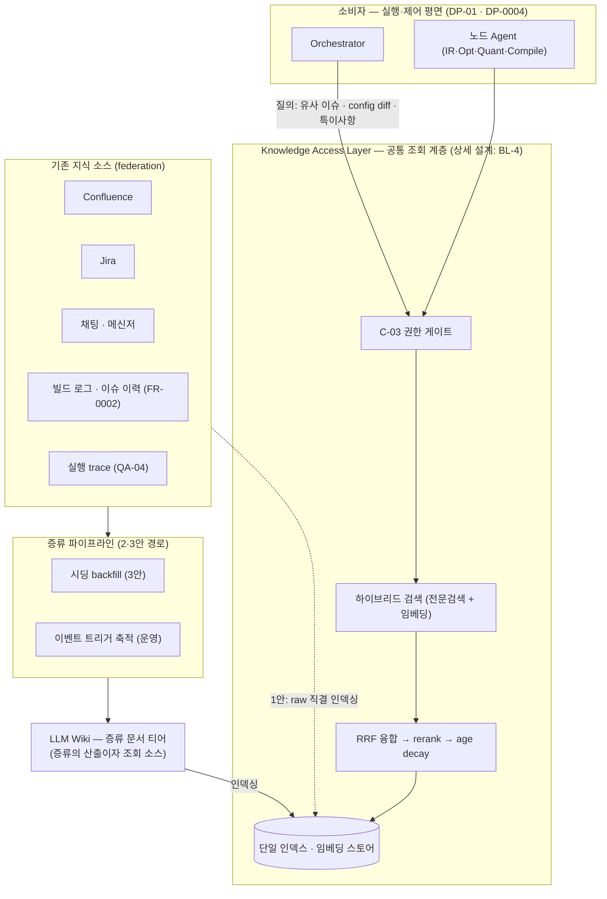

# DP-06 Agent 지식 베이스 구축 전략 (Knowledge Base Bootstrap) — 무(無)에서 어떻게 세우나

> category: DP | status: 초안 v2 (2026-08-10 디스커션 반영 재프레이밍 — 팀 검토 대기) | source: 신규 발굴 (자율 이슈처리 서사의 지식 공급 공백) + 필드 레퍼런스(Cerebras Knowledge) | updated: 2026-08-10
> drives: QA-07(Correctness)↑, QA-05(Efficiency), QA-01(Scalability)
> realizes: FR-0003(Regression 관리의 지식 축), FR-0004(이슈처리 근거 추적) | constrained-by: C-03(지식 접근도 권한 게이트 통과)
> **재프레이밍 note (v1 → v2, 2026-08-10 디스커션)**: v1은 "RAG vs LLM Wiki" **형태 비교**였다. 디스커션에서 ① **인덱싱·조회 계층은 두 안의 공통 필수 인프라**라 변별 축이 아니고(형태가 뭐든 인덱스가 있어야 찾는다), ② 콘텐츠 형태(raw vs 증류) 결정은 **부트스트랩 전략에 내포**되며, ③ 우리 현실은 "물릴 지식 자체가 0"(기존 Confluence·Jira 연동 RAG도, LLM wiki도 없음)이라 진짜 결정은 **어디서 시작하나**임이 드러남 — 필드 실증(Cerebras Knowledge, A7)이 이 재프레이밍을 뒷받침. v1의 RAG/Wiki 분석은 1안/2안 근거로 **승계**. 조회 계층 상세 설계는 `_backlog.md` BL-4. 미결정 트래킹: open-issues OI-13.

---

## 용어 (먼저 읽기 — 이 결정에서 쓰는 표현)

| 용어 | 뜻 |
|---|---|
| **지식 베이스 (Knowledge Base)** | Agent가 판단(불량 분석·회귀 선별 등)에 필요한 **조직 지식**(과거 이슈·config 변경 이력·모델별 특이사항·툴체인 제약)을 저장하고 **선별 공급**하는 계층. raw 산출물 저장소(FR-0002)와 구분 — KB는 그 **위의 조회·증류 계층** |
| **콜드스타트 / 부트스트랩** | 지식 베이스가 **비어 있는 상태에서 시작**하는 문제 / 그 초기 구축 전략. 본 DP의 결정 축 |
| **backfill (소급 인제스천)** | 기존에 쌓여 있던 소스(Confluence·Jira·채팅 로그·빌드 이력)를 **일괄로 긁어 인덱싱**하는 것 |
| **증류 (distillation)** | raw 데이터에서 LLM이 **질문·요약·해결책·관련 시스템만 추려 구조화 레코드로 정제**하는 것. Cerebras가 Slack 스레드를 raw로 임베딩하지 않고 증류 후 임베딩하는 기법(*thread distillation*)이 원형 (A7) |
| **조회 계층 (retrieval layer)** | 인덱스+검색으로 "원하는 지식을 찾아주는" 공통 인프라. **어느 대안이든 필수 — 본 DP의 비교 축이 아니라 공통 전제** (아래 §공통 전제) |
| **하이브리드 검색** | 임베딩(의미 유사) + 전문검색(에러 코드·플래그명 같은 정확 문자열) 등 **복수 신호를 융합**하는 검색. 순수 시맨틱 단독은 부족하다는 게 필드 관측(Cerebras) |
| **RRF / rerank / age decay** | RRF=복수 검색 결과의 순위 융합(Reciprocal Rank Fusion) / rerank=상위 후보 재정렬 / age decay=**신선한 지식이 낡은 지식을 랭킹에서 이기게** 하는 시간 감쇠 — staleness를 갱신이 아닌 **랭킹에서** 완화하는 tactic |
| **garbage-in** | 저품질 소스를 그대로 인덱싱하면 검색이 **오염된 근거를 공급** — grounding이 오히려 오진을 부르는 함정 (1안 리스크) |
| **닭-달걀 (콜드스타트 악순환)** | 지식이 없으면 초기 분석 정확도가 낮고 → 신뢰를 못 얻어 채택이 안 되고 → 이슈 처리가 없어 지식이 안 쌓이는 악순환 (2안 리스크) |
| **grounding / hallucination** | grounding = LLM 답을 실제 근거 데이터에 붙들어 매는 것 / hallucination = 근거 없이 지어내는 것. 사내 SDK·NPU 도메인은 학습 데이터에 없어 grounding 없이는 hallucination이 기본값 |
| **staleness (낡음)** | 저장된 지식이 갱신을 못 따라가 현실과 어긋난 상태. 증류 콘텐츠·임베딩 인덱스 모두에 있다(재인덱싱 랙) — 정도 차이 |
| **prompt cache 적합성** | 안정된 증류 문서는 반복 조회 시 prompt caching(QA-05 — 캐시 read ~10% 가격) 적중률이 오른다. 질의마다 조합이 바뀌는 raw top-k는 캐시 비친화 |
| **ASR / driving QA** | ASR=아키텍처 핵심 요구(목록·우선순위 SSoT: [`context/asr.md`](../asr.md)) / driving QA=이 결정이 좌우하는 주 품질속성 |
| **★ 등급 · S·T·R·N** | ★=그 QA 만족도(등급척도 앵커) · S 민감점 · T 교환점 · R 위험 · N 비위험(ATAM) |

---

## 공통 전제 — 조회 계층 (본 DP의 비교 축 아님, 채택 패턴)

> **어느 대안을 고르든 인덱싱·조회 계층은 필요하다.** 형태(raw/증류)가 달라도 "인덱스가 있어야 원하는 지식을 찾는다"는 점은 동일 — 따라서 조회 계층은 대안 간 변별 축이 아니라 **공통 전제**로 깔고, 필드 수렴 패턴을 채택한다.

**채택 패턴 (레퍼런스 아키텍처 = Cerebras Knowledge, A7)**: 모든 소스를 **단일 임베딩 스토어**로 연합 + **하이브리드 검색**(전문검색: 에러 코드·플래그명 정확 일치 / 임베딩: 패러프레이즈) + **RRF 융합 → rerank** + **age decay**(신선한 지식 우선). 우리 도메인(빌드 로그·config diff·quantize 플래그)은 정확 문자열 검색 수요가 커서 하이브리드가 옵션이 아니라 필수. **상세 설계(신호 구성·인덱스 기술 선택)는 `_backlog.md` BL-4** — 본 DP(시작 전략) 확정 후 후속 결정. 구조도는 슬라이드 2 참조.

---

## 슬라이드 요약 (본편 3장 + Appendix 1장 — 16:9)

### 슬라이드 1 — 왜 지식 베이스인가 (필요성)

**결정 포인트**: Agent가 불량 분석·회귀를 수행하려면 조직 지식에 접근할 수 있어야 한다. 조회 계층은 공통 전제 — 문제는 **물릴 지식이 지금 0이라는 것. 지식 베이스를 무(無)에서 어떻게 세우나.**

**필요성 3축** (사람이 하던 일을 Agent가 하려면 사람이 쓰던 지식이 필요하다):

| 축 | 문제 | 지식 베이스가 닫는 것 |
|---|---|---|
| **① 자율 이슈처리의 전제** | 불량 분석(failure triage)·회귀(regression) 선별은 **과거 유사 이슈·직전 config 변경·모델별 특이사항** 없이는 판단 자체가 불가능. 사람 엔지니어는 이 지식을 머리·위키·채팅에 갖고 있었다 — Agent에게는 공급 경로가 **없다** (Pain Point: 개인별 config 관리, Jira 대신 채팅 우회 → 지식 휘발) | 흩어진 조직 지식을 Agent가 **조회 가능한 형태**로 집약 → FR-0003(변경 추적·Regression), FR-0004(이슈처리 근거) |
| **② LLM 파라미터 지식의 한계** | 사내 SDK 파이프라인·NPU 툴체인·모델 조합은 **학습 데이터에 없다**(비공개+컷오프) → grounding 없이는 hallucination이 기본값. "일관되게 틀린" 분석은 rework 폭증(QA-07이 경고하는 바로 그 경로) | 판단을 **실제 근거(이슈 이력·로그·config diff)에 grounding** → QA-07 golden 정답률의 전제 |
| **③ 컨텍스트 윈도·토큰 한계** | 빌드 로그·20GB+ 산출물·전체 이슈 이력을 프롬프트에 다 넣을 수 없고, 욱여넣을수록 신규 토큰 캡(QA-05: ≤6k/8k) 위반 + 비용 폭증 | **필요한 지식만 선별 공급**하는 조회·증류 계층 → QA-05 신규 토큰 캡 안에서 grounding 성립 |

**동작 예시 (한 줄 서사)**: 불량 발생 → Agent가 *유사 과거 이슈 + 직전 config diff + 해당 모델 특이사항*을 지식 베이스에서 조회 → 원인 가설 수립 → 영향 범위 기반 회귀 세트 선별 실행 → 처리 결과가 다시 지식으로 축적(선순환).

> 요지: 지식 베이스는 "있으면 좋은 것"이 아니라 **자율 이슈처리의 성립 조건**이다. 그리고 지금 그 지식 베이스는 **비어 있다** — 기존 Confluence·Jira 연동 RAG도, LLM wiki도 없다. 다음 장에서 "어디서부터 세우나"를 결정한다.

### 슬라이드 2 — 공통 조회 계층 구조: 하나의 인덱스, 여러 지식 소스

**메시지**: 조회 계층은 대안 간 변별 축이 아니라 **공통 전제** — LLM Wiki든 기존 Confluence·Jira·채팅이든, 모든 지식 소스는 **하나의 조회 계층(단일 인덱스) 아래에 federation으로 붙는다.** 본 DP(슬라이드 3)는 이 구조에서 "소스를 어떻게 채우나"(부트스트랩)를 결정한다.

**구조 읽기**
- **소비자**(Orchestrator·노드 Agent)는 **C-03 권한 게이트**를 지나 조회 계층에만 질의 — 소스에 직접 접근하지 않는다(단일 진입점).
- **조회 계층**은 채택 패턴(§공통 전제) 그대로: 단일 인덱스 + 하이브리드 검색 + RRF·rerank + age decay. 상세는 BL-4.
- **소스는 federation** — LLM Wiki(증류 문서 티어)와 기존 소스(Confluence·Jira·채팅·빌드 로그·trace)가 같은 인덱스 아래 나란히 붙는다. LLM Wiki는 증류 파이프라인의 **산출이자 소스**(선순환 루프).
- **인덱싱 경로가 대안을 가른다**: 1안은 기존 소스를 **raw 직결**(점선), 2·3안은 **증류 경유**(실선) — 슬라이드 3의 비교가 곧 이 두 경로의 선택.

### 슬라이드 3 — 부트스트랩 전략: Backfill vs Forward vs Distill-seeded

> 대안별 column = (a) 도안 + (b) 설명 + (c) 별점(행=ASR). 도안 SVG는 미작성(TODO — 선택안 확정 후 `diagrams/`). **3안의 원형 = Cerebras Knowledge**(15K 쿼리/일 운영 실증, A7·Appendix 슬라이드).

| | **1안 · Backfill-first (raw 일괄 인덱싱)** | **2안 · Forward-only (운영 중 증류 축적)** | **3안 · Distill-seeded (증류 시딩 + 축적)** (권고) |
|---|---|---|---|
| **(a) 도안** | *(TODO: 기존 소스→일괄 인덱싱→조회)* | *(TODO: 빈 KB→이슈 처리→증류 축적)* | *(TODO: 기존 소스→증류 시딩→KB→운영 축적 선순환)* |
| **(b) 설명** | **구조**: 기존 소스(Confluence·Jira·채팅 로그·빌드 이력)를 **raw 그대로 일괄 인덱싱**해 첫날부터 조회 가능하게 한다. 쓰기 경로는 자동 인제스천뿐(큐레이션 없음). v1의 "RAG" 계보. **＋** 초기 커버리지를 즉시 확보하고, 데이터 증가를 인덱싱이 자동 흡수한다(조합 폭발에 강함). **－** 소스 품질이 낮은 걸 **알면서** 밀어넣는다 — Jira는 수동 업데이트 의존으로 부실하고 실제 지식은 채팅에 파묻혀 있음(Pain Point) → **garbage-in**: 오염된 근거가 grounding을 타고 오진을 만든다. raw chunk 주입이라 조회 토큰↑·캐시 비친화. | **구조**: **빈 손으로 시작**하고, 시스템 가동 후 Agent가 처리하는 이슈·빌드에서 postmortem·특이사항·회귀 패턴을 **증류해 축적**한다. 사람 감사(HITL audit) 가능. v1의 "LLM Wiki" 계보. **＋** 처음부터 정제 지식만 쌓여 품질이 높고, 증류 요약이라 조회 토큰↓·안정 문서 = prompt cache 친화(QA-05 정합). **－** **닭-달걀**: 콜드스타트 구간에 지식이 없어 초기 분석 정확도가 낮고 → 신뢰 형성 실패 → 채택 부진 → 이슈 처리량 부족 → 축적 정체의 악순환. 축적 속도가 이슈 처리량에 종속(선형). | **구조**: 기존 소스를 **증류 파이프라인에 통과시켜 시딩**(backfill하되 raw가 아닌 증류 산출물을 인덱싱 — Cerebras *thread distillation*의 backfill 적용) + 가동 후 2안의 운영 축적을 병행. "지식이 채팅에 파묻혀 있다"는 우리 Pain Point에 정확히 대응. **＋** 초기 커버리지와 지식 품질을 **동시에** 확보 — 1안의 garbage-in과 2안의 닭-달걀을 모두 회피. 조회는 증류 티어라 토큰 효율·캐시 친화 유지. **－** 시딩 시점 LLM 비용(QA-13)과 증류 파이프라인 복잡도, **증류 오염**(증류가 틀리면 오류가 정제된 형태로 고착 — 더 그럴듯해서 위험) 검증 부담. |
| **(c) QA-07 Correctness — 초기(콜드스타트)** | ★★☆ | ★☆☆ | ★★★ ◯ |
| **(c) QA-07 Correctness — 정상 상태** | ★★☆ | ★★★ | ★★★ |
| **(c) QA-05 Efficiency (조회 토큰)** | ★★☆ | ★★★ | ★★★ |
| **(c) QA-01 Scalability (축적 확장)** | ★★★ | ★★☆ | ★★★ |

> ★ 앵커: Correctness = golden 정답률 [93,99]=★★★(QA-07 — 초기/정상 분리는 콜드스타트 구간이 본 DP의 핵심 변별이라서) · Efficiency = 작업당 신규 토큰 ≤4k=★★★(QA-05, 캐시 분리집계) · Scalability = QA-01 등급척도. **3안 초기 ★★★◯** = 증류 시딩 품질 가정(표본 HITL 감사 + QA-07 golden 게이트 통과 PoC 확정 전 `◯`). 3안의 시딩 비용·복잡도는 별점 행(ASR) 밖 — QA-13·A5 참조.

**권고**: **3안 Distill-seeded** — 기존 소스에 건질 지식이 실재하고(채팅·Jira·빌드 이력 有) 시딩 비용을 감당할 수 있으면 3안. 기존 소스가 실질적으로 비었으면 2안이 강제되고, 시딩 비용이 binding이면 1안으로 시작해 증류를 점진 적용(→3안 수렴 경로, NR-2: 조회 계층이 공통이라 전환 비용 제한적). **택일 강행 금지 — 드라이버로 결정** (상세 → Appendix).

### Appendix 슬라이드 — Cerebras Knowledge (Field Reference)

본편에서 빠진 **필드 실증 상세**를 발표 Appendix 1장으로 유지: 파이프라인(소스 → LLM 증류 → 단일 임베딩 스토어 → 하이브리드 검색 → RRF·rerank → age decay → 인용 답변) + 3가지 교훈 매핑(raw를 임베딩하지 않는다 → 3안 원형 / 순수 시맨틱 부족 → 하이브리드 필수 / age decay → R-4 완화). 전문·출처는 A7.

---

## Appendix

### A1. 결정의 핵심 — "두 함정 사이의 결정"
- **왜 형태(RAG vs Wiki) 비교가 아닌가**: 인덱스·조회 계층은 어느 형태든 필수(공통 전제) → 변별 축이 못 된다. 콘텐츠 형태(raw vs 증류)는 시작 전략이 결정하면 따라온다 — backfill이면 raw가, forward/시딩이면 증류가 1급 콘텐츠. **v1의 형태 비교는 본 재프레이밍의 1안/2안 근거로 승계.**
- **왜 "그냥 컨텍스트에 다 넣으면"이 안 되나** (v1 승계): 물리적으로 안 들어가고(로그 수십 MB·이력 수년치), 넣을수록 QA-05 캡 위반 + 지연, 장문 중간 정보는 회수율 저하(lost-in-the-middle) — 선별 공급이 필수.
- **본 결정의 긴장**: 1안은 **garbage-in**(오염 grounding — 소스 부실을 우리가 이미 앎), 2안은 **닭-달걀**(콜드스타트 악순환 — 신뢰 형성 실패가 곧 채택 실패). 3안은 두 함정을 피하는 대신 시딩 비용·증류 오염 검증을 진다. "공짜 탈출구는 없다"가 이 DP의 교환점.

**결정 드라이버 (택일 2단 질문)**
> **Q1. "기존 소스(채팅·Jira·Confluence·빌드 이력)에 증류할 가치가 있는 지식이 실재하는가?"**
> - **없다(진짜 0) → 2안 Forward-only** — 시딩할 원료가 없으면 운영 축적뿐. 콜드스타트 구간은 HITL 비중을 높여 버틴다.
> - **있다 → Q2. "시딩 LLM 비용(QA-13)을 감당할 수 있는가?"**
>   - **가능 → 3안 Distill-seeded** (권고).
>   - **불가 → 1안 Backfill-first로 시작** 후 증류를 점진 적용 — 조회 계층이 공통이라 3안으로 무중단 수렴 가능(NR-2).

### A2. 후보 대안 (전문)
**1안. Backfill-first (raw 일괄 인덱싱)** — 구조: 기존 소스 전체를 raw로 임베딩 인덱싱, 자동 인제스천으로 지속 갱신. tactic: Retrieval grounding, 자동 인덱싱. 장점 [Scalability] 인덱싱이 증가 흡수·즉시 커버리지 / 큐레이션 노동 0. 단점 [Correctness] garbage-in(부실 Jira·노이즈 채팅이 오염 근거로) + chunk 단편성(인과 절단) / [Efficiency] raw top-k 토큰↑·캐시 비친화.

**2안. Forward-only (운영 중 증류 축적)** — 구조: 빈 KB에서 시작, 이슈 close·config 변경 이벤트마다 Agent가 증류 문서 축적, HITL audit. tactic: Knowledge distillation, 이벤트 트리거 갱신. 장점 [Correctness 정상상태] 정제 지식만 축적 / [Efficiency] 요약 조회+캐시 친화. 단점 [Correctness 초기] 콜드스타트 닭-달걀(악순환) / [Scalability] 축적이 이슈 처리량에 종속.

**3안. Distill-seeded (증류 시딩 + 운영 축적) — Cerebras Knowledge 원형** — 구조: ① 시딩 단계 — 기존 소스를 LLM 증류(질문·요약·해결책·관련 시스템의 구조화 레코드)로 변환해 인덱싱(raw를 임베딩하지 않는다), ② 운영 단계 — 2안의 이벤트 트리거 증류 병행, ③ 조회는 공통 계층(하이브리드+RRF+age decay). tactic: Thread distillation(backfill 적용), Seeding, 이벤트 트리거 축적. 장점: 초기 커버리지+품질 동시, 두 함정 회피. 자기 trade-off: 시딩 LLM 비용(QA-13)·파이프라인 복잡도·증류 오염 검증(HITL 표본 감사+golden 게이트).

### A3. 대안 × ASR 통합 매트릭스 (★ + S/T/R/N)
| 대안 | QA-07 초기 | QA-07 정상 | QA-05 Efficiency | QA-01 Scalability |
|---|:---:|:---:|:---:|:---:|
| 1안 Backfill-first | ★★☆ (S,R) | ★★☆ (R) | ★★☆ (T) | ★★★ (N) |
| 2안 Forward-only | ★☆☆ (S,R) | ★★★ (N) | ★★★ (S,T) | ★★☆ (R) |
| **3안 Distill-seeded** ✅ | ★★★◯ (S,T,R) | ★★★ (N) | ★★★ (S,T) | ★★★ (N) |

> 선택안(3안 권고 시)의 행이 세트 Traceability Matrix로 graduate. 3안의 비용 축(QA-13 시딩 비용)은 비-ASR이라 매트릭스 밖 — TP-2로 관리. S=민감점·T=교환점·R=위험·N=비위험.

### A4. 대안 고도화 (비선택안도 tactic으로 강화)
- **1안 강화 = 증류를 얹는 것**: raw 인덱싱에 contextual retrieval(chunk에 문맥 전치)·re-ranking을 더해 Correctness를 올릴 수 있으나, 소스 오염 자체는 못 지운다 — 근본 강화는 backfill을 증류로 바꾸는 것 = **3안으로 수렴**(DP-01 "Standby 승격"과 동형: 약점을 tactic으로 닫으면 강화안이 된다).
- **2안 강화 = 최소 시딩**: 콜드스타트 완화를 위해 "최근 N개월 해결 이슈만" 최소 증류 시딩 — 이 역시 3안의 축소판(시딩 범위가 파라미터일 뿐).
- **3안 staleness 강화**: 증류 콘텐츠의 낡음은 **age decay**(신선 우선 랭킹, Cerebras tactic) + 이벤트 트리거 재증류로 이중 완화 — v1 R-2의 `◯` 해제 조건을 "갱신 파이프라인"에서 "랭킹+갱신 이중 방어"로 확장.
- **조회 계층 상세(공통)**: 하이브리드 신호 구성(전문+임베딩+희소어 가중치)·RRF·rerank 설계는 BL-4 — 본 DP 확정 후 후속.

### A5. ATAM 분석
**민감점** — SP-1(backfill 소스 품질→QA-07, 1안) · SP-2(콜드스타트 구간 길이(이슈 처리량·축적 속도)→QA-07 초기·신뢰 형성, 2안) · SP-3(시딩 증류 품질→QA-07, 3안) · SP-4(증류 문서 안정성→캐시 적중률→QA-05, 2·3안).
**교환점** — **TP-1 (초기 커버리지 ↔ 지식 품질)** 본 DP 핵심: backfill은 넓고 빠르나 오염, forward는 깨끗하나 비어 있음 · TP-2 (시딩 품질 ↔ 시딩 비용: QA-07 ↔ QA-13) · TP-3 (조회 토큰 효율 ↔ 쓰기(증류) 비용: QA-05 ↔ QA-13, v1 승계).
**위험** — R-1(1안 garbage-in: 부실 Jira·노이즈 채팅 raw 인덱싱 → 오염 grounding → 오진, QA-07 — Pain Point로 실재) · R-2(2안 닭-달걀: 콜드스타트 저정확 → 신뢰 형성 실패 → 채택 부진 → 축적 정체 악순환) · R-3(3안 증류 오염: 시딩 증류가 틀리면 오류가 **정제된 형태로 고착** — 더 그럴듯해서 raw 오염보다 위험. HITL 표본 감사 + QA-07 golden 게이트로 방어) · R-4(staleness: 증류 콘텐츠·인덱스 공통(재인덱싱 랙 포함, 정도 차이) — age decay+이벤트 트리거 재증류로 완화).
**비위험** — NR-1(모든 안이 C-03 권한 게이트 하 동작 — pass/fail 제약이라 비교 축 아님) · **NR-2(조회 계층이 공통 전제라 대안 간 전환이 비가역이 아님** — 1안으로 시작해도 증류 티어를 얹어 3안으로 무중단 수렴 가능. "잘못 골라도 갈아엎지 않는다"가 본 DP의 안전판**)** · NR-3(모든 안이 FR-0002 Artifact Storage를 raw 원천으로 공유 — 저장 이중화 아님).

### A6. Cohesion (DP 간 보완·연결)
- **DP-01(오케스트레이션)·DP-0004(실행구조)와 역할 분리**: 그쪽은 Agent가 *어떻게 실행*되나(제어·실행 평면), 본 DP는 *무엇을 알고 판단하나*(지식 평면). 노드 Agent·오케스트레이터 모두 KB의 소비자.
- **FR-0002(Artifact Storage)와 계층 관계**: raw 산출물 저장은 FR-0002 몫, KB는 그 위의 조회·증류 계층(NR-3).
- **QA-04(Observability)가 원천 공급**: span trace·실행 이력·결정 로그가 운영 축적(2·3안 forward 경로)의 입력 — DP-0003 모니터링과 데이터 파이프 공유.
- **QA-07 eval 하네스와 상호 보강**: KB grounding은 golden 정답률의 전제(슬라이드 1 ②축), 역으로 QA-07 golden 게이트가 증류 오염(R-3)의 방어선 — eval/검증 서브시스템 DP(OI-7 후보)와 세트.
- **C-03(보안·안전)**: 지식 접근도 권한 게이트 통과 — Agent별 접근 범위 제한. 전 대안 공통 제약(NR-1).
- **module-view 반영 필요**: Repository 레이어에 `Knowledge Base`(단일 조회 계층 + 증류 파이프라인) 신설 후보 — 선택안 확정 시 반영(OI-13).
- **후속 결정**: 조회 계층 상세 설계 = `_backlog.md` **BL-4** (하이브리드 신호 구성·RRF·rerank·age decay 파라미터).

### A7. 별점 앵커 근거 (레퍼런스)
- **★ 필드 실증(3안 원형) — Cerebras Knowledge**: 사내 지식 베이스, 15K 쿼리/일 운영. ① *thread distillation* — raw Slack 스레드를 임베딩하지 않고 LLM이 질문·요약·해결책·관련 시스템의 구조화 레코드로 **증류 후 임베딩**(=3안 시딩·축적의 원형) ② 순수 시맨틱 검색 부족 → **하이브리드**(전문검색: 에러 코드·플래그명 / 임베딩: 패러프레이즈) + 희소어 가중치 + **RRF 융합·rerank** ③ **age decay**로 신선한 지식이 낡은 지식을 랭킹에서 이김(R-4 완화 tactic) ④ 전 소스 단일 임베딩 스토어 연합(=§공통 전제 채택 패턴). 소개: [Mervin Praison 정리](https://mer.vin/2026/07/how-cerebras-built-a-15k-query-day-internal-knowledge-base/) · [DataSci Ocean — Narrow-Waist Design](https://datasciocean.com/en/paper-intro/cerebras-rag/) · [MindStudio 해설](https://www.mindstudio.ai/blog/enterprise-rag-knowledge-base-cerebras-how-it-works) · 국문 소개: [GeekNews #31850](https://news.hada.io/topic?id=31850)
- RAG 원형·retrieval grounding: [Lewis et al., RAG (NeurIPS 2020)](https://arxiv.org/abs/2005.11401) · chunk 단편성 완화: [Anthropic — Contextual Retrieval](https://www.anthropic.com/news/contextual-retrieval)
- 장문 컨텍스트 중간 정보 회수율 저하(A1 "다 넣기" 반박): [Lost in the Middle (TACL 2024)](https://arxiv.org/abs/2307.03172)
- 안정 문서 prompt cache 경제성(2·3안 Efficiency 앵커): [Anthropic — prompt caching](https://platform.claude.com/docs/en/build-with-claude/prompt-caching) (cache read = 정상가 ~10%, QA-05와 동일 출처)
- Agent 경험의 구조화 기억·회고 증류(증류 축적 원형): [Generative Agents — memory stream & reflection (Park et al. 2023)](https://arxiv.org/abs/2304.03442)
- 별점 수치는 PoC로 확정(레퍼런스 수치 복제 금지). QA-07/05/01 등급척도 = `context/qa/QA-07·QA-05·QA-01`.
