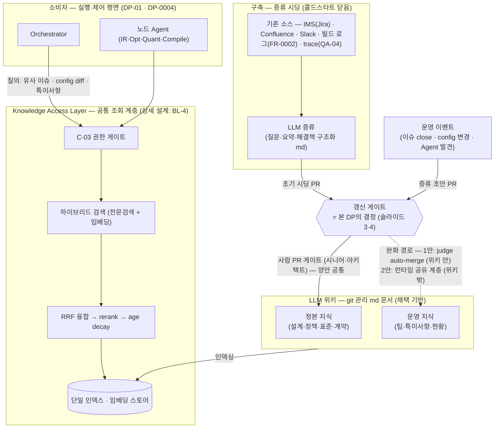
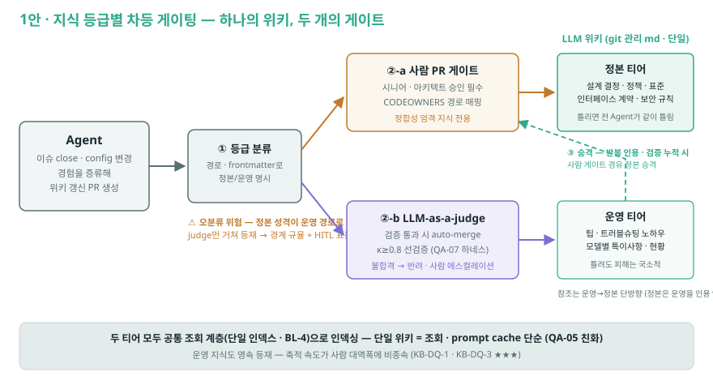
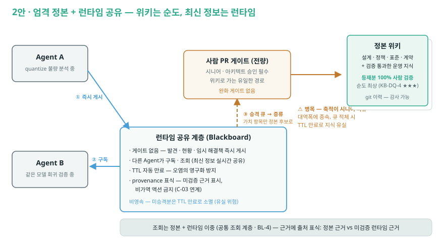

# DP-06 자율 Agent를 위한 지식베이스 설계 (Knowledge Base for Autonomous Agents) — LLM 위키 거버넌스: 차등 게이팅 vs 정본+런타임 공유

> category: DP | status: 초안 v4 (2026-08-13 거버넌스 재프레이밍 — 팀 검토 대기) | source: 신규 발굴 (자율 이슈처리 서사의 지식 공급 공백) + 필드 레퍼런스(Cerebras Knowledge·Wikipedia 문서 보호 정책·Blackboard 패턴) | updated: 2026-08-13
> drives: QA-07(Correctness)↑, QA-05(Efficiency) | 평가 보강: **KB-DQ**(지식 데이터 품질 — ISO/IEC 25012 앵커: 커버리지·신선도·축적 속도·**정합성(v4 신설)**, §지식 품질 평가 기준)
> realizes: FR-0003(Regression 관리의 지식 축), FR-0004(이슈처리 근거 추적) | constrained-by: C-03(지식 접근도 권한 게이트 통과)
> **재프레이밍 이력**: v1(2026-08-10) "RAG vs LLM Wiki" 형태 비교 → **v2(같은 날 디스커션)** 인덱싱·조회 계층은 공통 전제임을 확인, 결정 축을 부트스트랩 전략(Backfill/Forward/Distill-seeded)으로 전환 → **v3(같은 날 발표 용어 정비)** 대안을 1안 RAG / 2안 LLM 위키로 단순화, 증류 시딩·LLM-as-a-judge를 강화 tactic으로 재배치 → **v3.1(같은 날)** KB-DQ 신설(ISO/IEC 25012 앵커) → **v3.2(같은 날)** 설계명·배경 논지("실행을 넘어 참여로") 확정 → **v4(2026-08-13 거버넌스 재프레이밍)** 팀 방향 전환: **LLM 위키를 기반(base)으로 채택** — v3 A4 수렴 노트("증류 시딩의 산출과 위키 문서는 동형") 채택으로 형태 택일 종료. 위키는 기존 소스(**IMS(Jira)·Confluence·Slack**) **증류 md 문서로 구축**(콜드스타트를 증류 시딩으로 닫음) + 운영 축적. 결정 축 전환: "무엇으로 채우나" → **"위키 갱신을 어떻게 거버넌스하나"** — 새 대안 = **1안 지식 등급별 차등 게이팅**(정합성 엄격 지식=사람(시니어·아키텍트) PR 게이트 / 팁·현황=LLM-as-a-judge auto-merge) vs **2안 엄격 정본 + 런타임 공유 계층**(정본은 전량 사람 PR 게이트, Agent 생성 최신 정보는 위키 밖 런타임 계층에서 공유). KB-DQ-4(Consistency) 신설. 미결정 트래킹: open-issues OI-13.

---

## 용어 (먼저 읽기 — 이 결정에서 쓰는 표현)

| 용어 | 뜻 |
|---|---|
| **지식 베이스 (Knowledge Base)** | Agent가 판단(불량 분석·회귀 선별 등)에 필요한 **조직 지식**(과거 이슈·config 변경 이력·모델별 특이사항·툴체인 제약)을 저장하고 **선별 공급**하는 계층. raw 산출물 저장소(FR-0002)와 구분 — KB는 그 **위의 조회·증류 계층** |
| **LLM 위키 (LLM Wiki)** — v4 채택 기반 | Agent(LLM)가 지식을 **md 문서로 정리·갱신**하고 다른 Agent가 읽는 방식. **git 저장소의 md 문서**로 관리 → 모든 갱신이 **PR(변경 요청) 단위**로 흐른다(= 게이팅 논의의 성립 조건). 사람은 감사(audit)·승인 가능 |
| **증류 (distillation)** | raw 데이터에서 LLM이 **질문·요약·해결책·관련 시스템만 추려 구조화 문서로 정제**하는 것. v4에서는 **위키 구축 방법**: 기존 소스(IMS·Confluence·Slack·빌드 로그)를 증류해 초기 위키를 시딩(콜드스타트 닫음 — Cerebras thread distillation, A7) |
| **IMS** | Issue Management System(이슈관리시스템 — 우리 조직은 Jira). Confluence·Slack과 함께 증류 대상 기존 소스 |
| **정본 지식 (normative)** | 설계 결정·정책·표준·인터페이스 계약·보안 규칙 등 **정합성이 엄격하게 지켜져야 하는** 지식. 틀리면 이를 참조한 **모든 Agent가 일관되게 틀리는**(systemic) 파급 |
| **운영 지식 (operational)** | 팁·트러블슈팅 노하우·모델별 특이사항·작업 현황·최근 이슈 요약 등 **알면 좋은** 지식. 틀려도 피해가 해당 작업에 국한(국소적) |
| **PR 게이팅 (PR gating)** | 위키 갱신 PR을 **사람(시니어 엔지니어·아키텍트)이 리뷰·승인해야 병합**되는 게이트. CODEOWNERS로 문서 경로별 승인자 매핑 |
| **LLM-as-a-judge auto-merge** | 별도 judge LLM이 갱신 PR을 채점·검증해 **통과 시 사람 개입 없이 자동 병합**. 신뢰 조건 = **judge↔인간 일치도 κ ≥ 0.8 선검증**(QA-07 golden 채점 하네스 공유). 불합격은 반려 또는 사람 에스컬레이션 |
| **런타임 공유 계층 (runtime sharing layer)** | 위키(영속 정본) **밖**에서 Agent들이 작업 중 생성한 최신 정보(발견·현황·임시 해결책)를 **게이트 없이 즉시 게시·구독**하는 비영속 계층 — 고전 **Blackboard 패턴**의 적용. TTL·출처 표식 부착 |
| **TTL / provenance 표식** | 런타임 항목의 자동 만료 시한(오염의 영구화 방지) / 근거의 출처 등급 표시(**정본 근거 vs 미검증 런타임 근거**를 Agent 프롬프트에서 구분 — 미검증 근거로는 비가역 액션 금지, C-03 연계) |
| **승격 (promotion)** | 하위 신뢰 계층의 지식을 상위 계층으로 올리는 것 — 1안: 운영 티어 문서 → (사람 게이트) → 정본 티어 / 2안: 런타임 항목 → 증류 → (사람 게이트) → 정본 위키 |
| **오분류 (misclassification)** | 1안 고유 위험: 정본 성격의 지식이 **운영 티어로 잘못 분류**되어 judge auto-merge만 거쳐 등재 → 정합성 훼손이 완화 게이트로 새는 경로 |
| **조회 계층 (retrieval layer)** | 인덱스+검색으로 "원하는 지식을 찾아주는" 공통 인프라(하이브리드 검색+RRF+rerank+age decay — §공통 전제, BL-4). **본 DP의 비교 축 아님** |
| **staleness (낡음)** | 저장된 지식이 갱신을 못 따라가 현실과 어긋난 상태. v4에서는 **게이트 강도의 함수**: 게이트가 셀수록 정확하지만 낡는다 — 본 DP 핵심 긴장 |
| **prompt cache 적합성** | 안정된 위키 문서는 반복 조회 시 prompt caching(QA-05 — 캐시 read ~10% 가격) 적중률이 오른다. 갱신이 잦거나 조합이 바뀌는 컨텍스트는 캐시 비친화 |
| **KB-DQ / ISO·IEC 25012** | KB-DQ=본 DP 전용 **지식 데이터 품질 평가 기준**(커버리지·신선도·축적 속도·**정합성** — §지식 품질 평가 기준). 앵커 표준 = **ISO/IEC 25012 Data Quality Model**(25010은 시스템, 25012는 데이터 — 같은 SQuaRE 패밀리) |
| **RAGAS / context recall** | RAG 평가 필드 표준 프레임워크 / context recall=질의에 필요한 근거가 실제로 회수된 비율(커버리지 측정), faithfulness=답이 근거를 이탈하지 않는 정도 |
| **ASR / driving QA** | ASR=아키텍처 핵심 요구(목록·우선순위 SSoT: [`context/asr.md`](../../asr.md)) / driving QA=이 결정이 좌우하는 주 품질속성 |
| **★ 등급 · S·T·R·N** | ★=그 QA 만족도(등급척도 앵커) · S 민감점 · T 교환점 · R 위험 · N 비위험(ATAM) |

---

## 공통 전제 (v4 — 본 DP의 비교 축 아님, 채택 사항)

> v3까지의 결정 축("지식을 무엇으로 채우나")은 **팀 합의로 닫혔다**. 아래 3개는 어느 대안을 고르든 공통.

1. **LLM 위키 기반 채택** — 지식베이스의 형태는 **git 관리 md 문서 위키**. 구축은 기존 소스(**IMS(Jira)·Confluence·Slack·빌드 로그**)의 **증류 시딩**(콜드스타트 닫음 — v3 1안 강화 tactic의 승계, Cerebras thread distillation A7) + 운영 이벤트(이슈 close·config 변경·Agent 발견)의 **증류 축적**. 근거 = v3 A4 수렴 노트: 증류 시딩의 산출(구조화 레코드)과 위키 문서는 **동형** — "RAG vs 위키"는 택일이 아니라 같은 위키의 구축 경로였다.
2. **조회 계층** — 위키·잔여 소스를 **단일 임베딩 스토어**로 연합 + **하이브리드 검색**(전문검색: 에러 코드·플래그명 / 임베딩: 패러프레이즈) + **RRF 융합 → rerank → age decay**. 상세 설계는 `_backlog.md` **BL-4**. 구조도는 슬라이드 2.
3. **정본 지식의 사람 게이트 — 양안 공통**: 설계·정책·표준 등 **정본(normative) 지식의 갱신은 사람(시니어·아키텍트) PR 게이팅을 거친다**. 이건 대안이 아니라 바닥선(C-03 정합) — **대안이 갈리는 건 "정본이 아닌 지식(팁·현황·최신 정보)을 어디로, 어떤 게이트로 흘리나"** 뿐이다.

**본 DP의 새 긴장**: 위키 갱신을 전부 사람이 검증하면 정합성은 완벽하지만 **사람이 병목**이 된다 — "사람이 병목이라 자동화한다"는 시스템 목적(Pain Point)을 지식 계층에서 재생산하는 자기모순. 반대로 전부 자동으로 열면 축적은 빠르지만 **오염이 정본을 침식**한다. 게이트를 **어디에, 얼마나 세게** 거나 — 이것이 결정이다.

---

## 지식 품질 평가 기준 (KB-DQ) — ISO/IEC 25012 앵커

> **왜 별도 기준인가**: 기존 ASR 중 본 DP에 실제로 물릴 수 있는 건 **QA-07(정확성)·QA-05(토큰 효율)** 뿐이다. 커버리지·신선도·축적 속도·정합성은 시스템 품질속성이 아니라 **"Agent에게 공급되는 데이터의 품질"** — 데이터 품질은 SQuaRE 패밀리의 **ISO/IEC 25012(Data Quality Model)** 가 표준이다. 25012의 고유(inherent) 특성 5개(Accuracy·**Completeness**·**Consistency**·Credibility·**Currentness**)가 정확히 이 자리다. **v4에서 KB-DQ-4 정합성(Consistency) 신설** — 결정 축이 거버넌스로 바뀌며 "지식 항목 간 모순 없음"이 대안 변별의 핵심 기준이 됐다. 측정은 RAG 필드 표준 **RAGAS** + 거버넌스 감사 지표.

| KB-DQ 기준 | ISO/IEC 25012 앵커 | 정의 | 측정 (예시 KPI — PoC로 확정) |
|---|---|---|---|
| **KB-DQ-1 커버리지** | **Completeness** (고유) | 질의가 요구하는 지식이 KB에 존재·회수되는 정도 — **영속 등재분 기준**(만료·유실분은 커버리지 손실) | golden 질의셋 대비 **context recall**(RAGAS) + 미회수(no-evidence)율 + **유실률**(생성됐으나 영속화 실패한 지식 비율) |
| **KB-DQ-2 신선도** | **Currentness** (고유) | 지식이 원본 현실을 반영하는 최신성 — v4에선 **게이트 통과 지연이 주 변수** | 이벤트 발생 → 조회 가능 랙 p95 + **stale-hit율**(낡은 근거의 top-k 진입 비율) |
| **KB-DQ-3 축적 속도** | (25012 직접 특성 아님 — Currentness의 운영 파생) | 새 지식이 **영속 계층(위키)에 등재**되기까지의 속도 | 이벤트 발생 → 위키 병합 **time-to-knowledge** p95 + 주당 신규 등재 문서 수 + **승격 큐 체류시간**(2안) |
| **KB-DQ-4 정합성 (v4 신설)** | **Consistency** (고유) | 지식 항목 간 모순 없음 — 정본 내 상호 모순, 정본↔운영/런타임 지식의 모순 | 표본 감사 **모순 검출률** + **정본 위반 등재 건수**(1안: 오분류 감사 / 2안: 런타임 항목의 정본 충돌률) |
| *(재사용)* 정확성 | 25012 **Accuracy**와 접점 — 측정은 **QA-07에 위임** | 회수 근거·생성 답의 옳음 | QA-07 golden 정답률(재정의 금지) + RAGAS **faithfulness** |
| *(재사용)* 토큰 효율 | (25012 밖 — 시스템 측) **QA-05에 위임** | 조회가 소비하는 신규 토큰 | QA-05 신규 토큰 캡 · 캐시 분리집계 |

- **검색 품질(context precision)** 은 대안 변별이 아니라 공통 조회 계층의 품질 → **BL-4 평가 지표**로 이관.
- **위상**: KB-DQ는 현재 **DP-06-로컬 평가 기준**(별점 보조 매트릭스) — QA(전사 품질속성)로의 승격 여부는 팀 디스커션(OI-13). 수치는 전부 예시값, PoC로 확정.

---

## 슬라이드 요약 (본편 4장 + Appendix 1장 — 16:9)

### 슬라이드 1 — 자율 Agent를 위한 지식베이스: 왜 필요한가 (배경)

**논지 — "실행을 넘어 참여로"**: Agent가 **시키는 일을 실행하는 데 그치지 않고, 이슈 생성 → 분석 → 해결까지 능동적으로 개발에 참여**하게 하려면(**AI-DLC**), 그 판단마다 **적절한 정보를 필요할 때 공급해 주는 지식베이스**가 필요하다.

| 시키는 일을 하는 Agent | → | **능동적으로 참여하는 Agent (AI-DLC)** |
|---|:---:|---|
| 정해진 명령을 실행 — 필요한 정보가 **입력(프롬프트·설정)에 이미 다 있다** | | 불량을 감지해 **이슈를 생성**하고, 원인을 **분석**하고, 수정·회귀 검증으로 **해결**한다 — 매 단계가 판단이고, **판단마다 조직 지식이 필요**하다 |

**필요성 3축** (왜 그 지식을 "지식베이스"로 공급해야 하나 — LLM 혼자서는 안 되는 이유):

| 축 | 문제 | 지식 베이스가 닫는 것 |
|---|---|---|
| **① 자율 이슈처리의 전제** | 불량 분석(failure triage)·회귀(regression) 선별은 **과거 유사 이슈·직전 config 변경·모델별 특이사항** 없이는 판단 자체가 불가능. 사람 엔지니어는 이 지식을 머리·위키·채팅에 갖고 있었다 — Agent에게는 공급 경로가 **없다** (Pain Point: 개인별 config 관리, Jira 대신 채팅 우회 → 지식 휘발) | 흩어진 조직 지식을 Agent가 **조회 가능한 형태**로 집약 → FR-0003(변경 추적·Regression), FR-0004(이슈처리 근거) |
| **② LLM 파라미터 지식의 한계** | 사내 SDK 파이프라인·NPU 툴체인·모델 조합은 **학습 데이터에 없다**(비공개+컷오프) → grounding 없이는 hallucination이 기본값. "일관되게 틀린" 분석은 rework 폭증(QA-07이 경고하는 바로 그 경로) | 판단을 **실제 근거(이슈 이력·로그·config diff)에 grounding** → QA-07 golden 정답률의 전제 |
| **③ 컨텍스트 윈도·토큰 한계** | 빌드 로그·20GB+ 산출물·전체 이슈 이력을 프롬프트에 다 넣을 수 없고, 욱여넣을수록 신규 토큰 캡(QA-05: ≤6k/8k) 위반 + 비용 폭증 | **필요한 지식만 선별 공급**하는 조회·증류 계층 → QA-05 신규 토큰 캡 안에서 grounding 성립 |

**동작 예시 (한 줄 서사)**: 불량 감지 → Agent가 **이슈 생성** → *유사 과거 이슈 + 직전 config diff + 해당 모델 특이사항*을 지식베이스에서 조회 → 원인 가설 수립(**분석**) → 수정·영향 범위 기반 회귀 검증(**해결**) → 처리 결과가 다시 지식으로 축적(선순환).

> 요지: **실행하는 Agent는 명령이면 충분하지만, 참여하는 Agent는 지식이 있어야 한다.** 무엇으로 채울지는 결정됐다 — **LLM 위키를 기존 소스(IMS·Confluence·Slack) 증류로 구축**한다(슬라이드 2). 남은 결정은 **그 위키를 어떻게 오염 없이, 그러나 사람 병목 없이 갱신하나** — 거버넌스다(슬라이드 3·4).

### 슬라이드 2 — 공통 구조: 증류로 구축한 LLM 위키, 그리고 갱신 게이트라는 결정

**메시지**: 지식베이스 = **git 관리 md 위키**. 기존 소스(IMS·Confluence·Slack)를 **증류 시딩**해 콜드스타트 없이 시작하고, 운영 이벤트에서 계속 축적하며, 단일 조회 계층으로 공급한다. **정본(설계·정책) 갱신의 사람 PR 게이트는 양안 공통** — 본 DP의 결정(슬라이드 3·4)은 **비정본 지식(팁·현황·최신 정보)의 흐름**이다.

**구조 읽기**
- **소비자**(Orchestrator·노드 Agent)는 **C-03 권한 게이트**를 지나 조회 계층에만 질의 — 소스에 직접 접근하지 않는다(단일 진입점).
- **구축 경로**: 기존 소스를 raw 그대로 넣지 않고 **증류 md로 시딩**(garbage-in 원천 차단 — Cerebras 실증 A7). 이후 운영 이벤트가 증류 초안 PR로 이어진다.
- **갱신 게이트가 결정 포인트**: 정본으로 가는 사람 PR 게이트는 공통(굵은 선). 점선 — 비정본 지식을 **위키 안 완화 게이트**(1안)로 받을지, **위키 밖 런타임 계층**(2안)으로 돌릴지가 대안을 가른다.

### 슬라이드 3 — 대안 구조도: 비정본 지식은 어디로 흐르는가

**메시지**: 두 대안 모두 정본은 사람이 지킨다. 갈리는 것은 **팁·현황·최신 정보의 행선지** — 1안은 **위키 안**에 완화 게이트(judge auto-merge) 티어를 만들어 **영속 등재**하고, 2안은 **위키 밖** 런타임 계층에서 **게이트 없이 즉시 공유**하되 영속화(승격)는 전량 사람 게이트를 다시 거친다.

| 1안 지식 등급별 차등 게이팅 | 2안 엄격 정본 + 런타임 공유 |
|---|---|
|  |  |

**읽는 포인트**
- **1안 차등 게이팅**: 위키를 **정본 티어 / 운영 티어**로 구분(경로·frontmatter로 명시). ① Agent 증류 초안 PR → ② **분류**(정본 성격? 운영 성격?) → ③-a 정본 → **사람(시니어·아키텍트) PR 게이트** / ③-b 운영 → **LLM-as-a-judge 검증 후 auto-merge**(κ≥0.8, 불합격 반려·에스컬레이션) → ④ 두 티어 모두 인덱싱·조회 → ⑤ 반복 인용·검증된 운영 문서는 **사람 게이트 경유로 정본 승격**. 위험 표시: **오분류** — 정책성 지식이 운영 티어로 새면 judge만 거치고 등재된다(경계가 곧 방어선).
- **2안 정본+런타임**: 위키는 **전량 사람 PR 게이트**(등재분 100% 사람 검증 — 순도 최상). ① Agent가 작업 중 발견·현황을 **런타임 공유 계층에 즉시 게시**(게이트 없음) → ② 다른 Agent가 **구독·조회**(TTL·provenance 표식 부착 — 미검증 근거로는 비가역 액션 금지) → ③ 가치 있는 항목은 **승격 큐 → 증류 → 사람 게이트 → 정본 등재** → ④ 미승격분은 TTL 만료로 소멸. 위험 표시: **사람 게이트 병목** — 승격이 시니어 리뷰 대역폭에 종속, 큐 적체 시 지식이 만료로 유실된다.

### 슬라이드 4 — 차등 게이팅 vs 정본+런타임 공유: 비교·결정

> 대안별 column = (a) 도안 + (b) 설명 + (c) 별점(행=ASR·KB-DQ). 공통 전제(위키+증류 구축·조회 계층·정본 사람 게이트)는 §공통 전제.

| | **1안 · 지식 등급별 차등 게이팅 (Tiered Gating)** | **2안 · 엄격 정본 + 런타임 공유 (Canonical + Runtime Sharing)** |
|---|---|---|
| **(a) 도안** | [`diagrams/1an-tiered-gating.svg`](diagrams/1an-tiered-gating.svg) (슬라이드 3) | [`diagrams/2an-canonical-runtime.svg`](diagrams/2an-canonical-runtime.svg) (슬라이드 3) |
| **(b) 설명** | **구조**: 위키를 **정본 티어(설계·정책·표준·계약)와 운영 티어(팁·특이사항·현황)로 구분**하고 게이트를 차등 적용 — 정본 = **사람(시니어·아키텍트) PR 게이팅**(CODEOWNERS 경로 매핑), 운영 = **LLM-as-a-judge 검증 후 auto-merge**(κ≥0.8 선검증, QA-07 하네스 공유). 반복 인용·검증된 운영 문서는 사람 게이트 경유 **정본 승격**. 원형 = Wikipedia 문서 보호 등급(문서 중요도별 편집 권한 차등 — 사람 위키에서 검증된 거버넌스, A7′). **＋** 운영 지식도 **영속 등재·검색 가능**(축적이 남는다). auto-merge라 축적 속도가 사람 대역폭에 비종속. 단일 위키 = 조회·캐시 단순(QA-05 친화). 사람 리뷰 부하가 정본에만 국소화. **－** **오분류 위험**: 정책성 지식이 운영 티어로 잘못 분류되면 judge만 거쳐 등재 — 완화 게이트가 정합성 훼손의 우회로가 된다(경계 룰 + judge의 "정본 성격 감지 시 에스컬레이션" + 사람 표본 감사로 방어). 운영 티어 품질이 judge 성능(κ)에 종속. **🛠 강화 tactic — 승격·참조 규율**: 티어 간 **단방향 참조**(정본은 운영 문서를 인용하지 않음 — 모순 전파 차단) + 운영→정본 승격 경로 상시 운영 + 오분류 표본 감사(주기적 HITL). | **구조**: 위키(정본)는 **전량 사람 PR 게이팅** — 등재분은 100% 사람 검증 통과(순도 최상). Agent가 생성하는 최신 정보(발견·현황·임시 해결책)는 위키에 쓰지 않고 **런타임 공유 계층**(Blackboard 패턴)에 **게이트 없이 즉시 게시** → 다른 Agent가 구독·조회. 항목엔 **TTL**(자동 만료)과 **provenance 표식**(미검증 근거 표시 — 비가역 액션 금지, C-03 연계) 부착. 가치 있는 항목은 **승격 큐 → 증류 → 사람 게이트 → 정본 등재**. **＋** **정본 순도 100%**(사람 검증만 통과 — KB-DQ-4 최상). 미검증 정보가 애초에 정본 밖 격리 — 오염이 영속층에 못 들어온다. 최신 정보는 **게이트 지연 0으로 즉시 공유**(신선도 최상). **－** **사람 게이트 병목**: 영속 축적이 시니어 리뷰 대역폭에 종속 — Pain Point("사람이 병목")의 지식 계층 재생산. 승격 큐 적체 → TTL 만료 → **지식 유실**(커버리지 손실). 런타임 계층은 무검증 즉시 전파라 틀린 정보의 단기 확산(표식·TTL로 국소화). 정본+런타임 **이중 조회** 복잡도, 런타임은 캐시 비친화. **🛠 강화 tactic — 승격 큐 SLA + 만료 정책**: 승격 큐 체류시간 SLA(예: p95 ≤ 1주)·리뷰 당번제 + TTL 만료 전 재게시·중요도 태깅으로 유실 완화 + age decay로 런타임 항목의 랭킹 자동 강등. |
| **(c) [ASR] QA-07 Correctness — 정본 지식 정합성** | **★★★◯** (사람 게이트 — 조건: 오분류 감사 규율) | **★★★** (전량 사람 게이트 — 구조적 보장) |
| **(c) [ASR] QA-07 Correctness — 운영·최신 지식** | **★★★◯** (judge 검증 등재 — κ≥0.8 조건) | ★★☆ (런타임 무검증 — 표식·TTL로 피해 국소화) |
| **(c) [ASR] QA-05 Efficiency (조회 토큰)** | ★★★ (단일 위키·안정 문서 — 캐시 친화) | ★★☆ (정본+런타임 이중 조회, 런타임 캐시 비친화) |
| **(c′) [KB-DQ-1] 커버리지 (25012 Completeness)** | ★★★ (운영 지식도 영속 등재) | ★★☆ (승격 병목 — TTL 만료 유실분) |
| **(c′) [KB-DQ-2] 신선도 (25012 Currentness)** | ★★☆ (judge 판정 지연 개재 — 분 단위) | **★★★** (런타임 즉시 공유 — 게이트 지연 0) |
| **(c′) [KB-DQ-3] 축적 속도 (영속 time-to-knowledge)** | **★★★** (운영 티어 auto-merge — 사람 비종속) | ★☆☆ (전량 사람 게이트 — 시니어 대역폭 종속) |
| **(c′) [KB-DQ-4] 정합성 (25012 Consistency, v4 신설)** | ★★☆ (오분류·티어 간 모순 위험 — 감사·단방향 참조로 완화) | **★★★** (정본 순도 — 미검증은 정본 밖 격리) |

> ★ 앵커 — **[ASR] 행**: Correctness = golden 정답률 [93,99]=★★★(QA-07 — 정본/운영 분리는 두 지식군의 오염 경로·파급이 달라서) · Efficiency = 작업당 신규 토큰 ≤4k=★★★(QA-05, 캐시 분리집계). **[KB-DQ] 행**: §지식 품질 평가 기준(ISO/IEC 25012 앵커). **◯** = 조건부 — 1안 정본 ★★★◯는 오분류 표본 감사 규율 전제, 1안 운영 ★★★◯는 judge κ≥0.8 선검증 조건(QA-07과 동일). 강화 tactic 비용(judge 판정 토큰·시니어 리뷰 공수·승격 큐 운영)은 비-ASR(QA-13) → 교환점 TP-2로 관리.

**권고**: 드라이버로 택일 — **Q1** 시니어·아키텍트 리뷰 대역폭이 위키 갱신 **전량**을 감당하는가? 감당 못 하면(우리 상황 — 사람 병목 제거가 시스템 목적) → **1안 차등 게이팅**(권고). **Q2** (감당한다면) Agent 간 **미검증 최신 정보의 실시간 공유**가 업무 흐름에 필수인가(동시 다발 파이프라인의 현황 전파)? → 필수면 **2안**(정본 순도 + 런타임 즉시성), 아니면 어느 쪽도 유효. **수렴 노트**: 두 대안의 계층은 직교라 **1안 + 2안의 런타임 계층**을 얹는 하이브리드로 수렴 가능(A4) — "잘못 골라도 갈아엎지 않는다". (상세 → Appendix.)

### Appendix 슬라이드 — Cerebras Knowledge (Field Reference)

본편에서 빠진 **필드 실증 상세**를 발표 Appendix 1장으로 유지: 파이프라인(소스 → LLM 증류 → 단일 임베딩 스토어 → 하이브리드 검색 → RRF·rerank → age decay → 인용 답변) + 3가지 교훈 매핑(raw를 임베딩하지 않는다 → §공통 전제 1 증류 시딩의 원형 / 순수 시맨틱 부족 → 하이브리드 필수 / age decay → 런타임·staleness 완화 tactic). 전문·출처는 A7. 거버넌스 원형(Wikipedia 문서 보호·Blackboard 패턴)은 A7′.

---

## Appendix

### A1. 결정의 핵심 — "정합성과 속도, 게이트를 어디에 긋나"
- **왜 형태(RAG vs 위키)는 더 이상 비교 축이 아닌가**: v3 A4 수렴 노트대로 증류 시딩의 산출과 위키 문서는 동형 — 팀이 **위키 기반 + 증류 구축**으로 합의(공통 전제 1). 남는 진짜 결정은 **갱신 거버넌스**다.
- **왜 "전부 사람이 보면 되지"가 안 되나**: 위키 갱신은 이슈 close·config 변경마다 발생(일 수십 건 규모) — 전량 사람 리뷰는 시니어 대역폭을 즉시 초과하고, "사람이 병목이라 자동화한다"는 시스템 목적(Pain Point)을 지식 계층에서 재생산한다.
- **왜 "전부 자동으로 열면 되지"도 안 되나**: 설계·정책이 judge만 거쳐 바뀌면 틀린 정본을 **모든 Agent가 일관되게** 참조한다 — 국소 오류가 아니라 systemic 오염(QA-07 최악 경로). 정본의 사람 게이트는 협상 불가(공통 전제 3).
- **본 결정의 긴장**: 그래서 결정은 **비정본 지식의 흐름**이다. 1안은 **영속을 얻고 오분류 위험**을 안는다(위키 안 완화 게이트), 2안은 **순도를 얻고 병목·유실 위험**을 안는다(위키 밖 무게이트 + 전량 사람 승격). "공짜 게이트는 없다"가 이 DP의 교환점.

**결정 드라이버 (택일 2단 질문)**
> **Q1. "시니어·아키텍트 리뷰 대역폭이 위키 갱신 전량을 감당하는가?"**
> - **아니오 → 1안 차등 게이팅** (권고 — 우리 상황: 사람 병목 제거가 시스템 목적, 운영 지식 유실은 축적 자산의 손실).
> - **감당한다 → Q2. "미검증 최신 정보의 Agent 간 실시간 공유가 업무 흐름에 필수인가?"**
>   - **필수 → 2안 정본+런타임** — 정본 순도와 런타임 즉시성을 동시에.
>   - **아니다 → 어느 쪽도 유효** — 승격 큐 운영 비용(2안) vs 오분류 감사 비용(1안)으로 판정.

### A2. 후보 대안 (전문)
**1안. 지식 등급별 차등 게이팅 (Tiered Gating)** — 구조: 단일 위키를 정본 티어(설계·정책·표준·계약)/운영 티어(팁·특이사항·현황)로 구분(경로+frontmatter 명시), 게이트 차등 — 정본=사람(시니어·아키텍트) PR 게이팅(CODEOWNERS), 운영=LLM-as-a-judge 검증 auto-merge(κ≥0.8 선검증, QA-07 하네스 공유). tactic: 티어 단방향 참조(정본→운영 인용 금지), 운영→정본 승격 경로, 오분류 HITL 표본 감사. 장점 [KB-DQ 커버리지·축적 속도] 운영 지식 영속 등재·사람 비종속 축적 / [Efficiency] 단일 위키 캐시 친화 / 사람 부하 정본 국소화. 단점 [KB-DQ-4·Correctness] 오분류 시 완화 게이트가 정합성 우회로 — 경계 규율·judge 품질에 종속.

**2안. 엄격 정본 + 런타임 공유 (Canonical + Runtime Sharing)** — 구조: 위키는 전량 사람 PR 게이팅(순도 100%), Agent 생성 최신 정보는 위키 밖 런타임 공유 계층(Blackboard 패턴)에 무게이트 즉시 게시·구독(TTL·provenance 표식, 미검증 근거 비가역 액션 금지 = C-03), 승격 큐→증류→사람 게이트→정본. tactic: 승격 큐 SLA·리뷰 당번제, TTL·age decay, provenance 태깅. 장점 [KB-DQ-4·Correctness 정본] 구조적 순도 보장 — 오염이 영속층 진입 불가 / [KB-DQ-2] 런타임 즉시 공유. 단점 [KB-DQ-1·3] 영속 축적이 사람 대역폭 종속(병목) — 큐 적체 시 TTL 유실 / [Correctness 운영] 런타임 무검증 전파 / [Efficiency] 이중 조회·캐시 비친화.

### A3. 대안 × 평가 기준 통합 매트릭스 (★ + S/T/R/N)

**[ASR] 기존 품질속성** (QA-07·QA-05만 실제로 물림):

| 대안 | QA-07 정본 정합성 | QA-07 운영·최신 지식 | QA-05 Efficiency |
|---|:---:|:---:|:---:|
| 1안 차등 게이팅 | **★★★◯** (S,R — 오분류 감사 조건) | **★★★◯** (S,R→N — judge κ 조건) | ★★★ (N) |
| 2안 정본+런타임 | **★★★** (N — 구조적) | ★★☆ (S,R — 무검증 전파, 표식 완화) | ★★☆ (T — 이중 조회) |

**[KB-DQ] 지식 데이터 품질** (ISO/IEC 25012 앵커 — §지식 품질 평가 기준):

| 대안 | KB-DQ-1 커버리지 | KB-DQ-2 신선도 | KB-DQ-3 축적 속도 | KB-DQ-4 정합성 (v4) |
|---|:---:|:---:|:---:|:---:|
| 1안 차등 게이팅 | ★★★ (N) | ★★☆ (T — judge 지연) | **★★★** (N — 사람 비종속) | ★★☆ (S,R — 오분류·티어 모순) |
| 2안 정본+런타임 | ★★☆ (S,R — TTL 유실) | **★★★** (N — 즉시 공유) | ★☆☆ (S,R — 사람 병목) | **★★★** (N — 격리 구조) |

> 선택안 확정 시 해당 행이 세트 Traceability Matrix로 graduate. 강화 tactic 비용(judge 판정 토큰·시니어 리뷰 공수·승격 큐 운영 — QA-13)은 비-ASR이라 매트릭스 밖 — TP-2로 관리. S=민감점·T=교환점·R=위험·N=비위험.

### A4. 강화 tactic 상세 (+ 수렴 노트)
- **1안 + 승격·참조 규율**: ① **티어 단방향 참조** — 정본 문서는 운영 문서를 인용하지 않는다(운영→정본 방향만 허용): 운영 티어의 오류가 정본의 논거로 전파되는 경로 차단(KB-DQ-4 방어). ② **승격 경로 상시 운영** — 반복 인용(조회 로그)·judge 고신뢰 판정이 누적된 운영 문서를 정본 승격 후보로 자동 추천 → 사람 게이트 경유 승격. ③ **오분류 표본 감사** — 운영 티어 신규 등재분을 주기 HITL 표본 감사(정본 성격 유입 검출 = KB-DQ-4 KPI). judge 프롬프트에 "정본 성격(설계·정책·계약 변경) 감지 시 auto-merge 금지·사람 에스컬레이션" 룰 내장.
- **2안 + 승격 큐 SLA·만료 정책**: ① 승격 큐 체류시간 SLA(예: p95 ≤ 1주) + 시니어 리뷰 당번제로 병목 상한 관리. ② TTL 만료 전 재게시·중요도 태깅으로 가치 항목 유실 완화. ③ **provenance 표식 강제** — 조회 결과에 정본/런타임 출처가 항상 표시되고, 미검증 런타임 근거만으로는 비가역 액션(배포·정책 변경) 불가(C-03 연계). ④ age decay가 런타임 항목을 랭킹에서 자동 강등(신선할 때만 이긴다).
- **공통**: judge 하네스는 **QA-07 golden 채점 하네스 공유**(κ≥0.8 선검증 — 1안은 auto-merge 게이트로, 2안은 승격 큐 사전 필터로 재사용 가능). staleness는 조회 계층 age decay + 이벤트 트리거 재증류로 이중 완화.
- **수렴 노트 (디스커션 포인트, 정식 대안 아님)**: 두 대안의 추가 계층은 **직교**다 — 1안의 운영 티어(영속·완화 게이트)와 2안의 런타임 계층(비영속·무게이트)은 서로 배제하지 않는다. **1안으로 시작해 런타임 계층을 얹으면** 3계층(정본/운영/런타임 = 게이트 강도 스펙트럼)으로 자연 확장된다(NR-3: 전환 비가역 아님 — "잘못 골라도 갈아엎지 않는다").

### A5. ATAM 분석
**민감점** — SP-1(티어 경계 정의·분류 품질 → 정본 정합성, 1안) · SP-2(judge κ → 운영 티어 품질, 1안 / 승격 사전 필터 품질, 2안) · SP-3(시니어 리뷰 대역폭 → 승격 큐 체류시간·축적 속도, 2안) · SP-4(TTL 길이 → 신선도↔유실·오염 노출시간의 양날, 2안) · SP-5(위키 문서 안정성 → 캐시 적중률 → QA-05, 양안).
**교환점** — **TP-1 (정합성 보증 ↔ 축적 속도)** 본 DP 핵심: 게이트가 셀수록 순도는 오르고 축적은 느려진다 — 1안은 티어로, 2안은 계층으로 이 긴장을 자른다 · TP-2 (거버넌스 비용 ↔ 정확성: judge 판정 토큰·시니어 리뷰 공수·승격 큐 운영(QA-13) ↔ QA-07) · TP-3 (런타임 즉시 공유 ↔ 미검증 전파: 신선도(KB-DQ-2) ↔ 단기 오염 노출, 2안) · TP-4 (영속 등재 ↔ 오분류 노출: 커버리지(KB-DQ-1) ↔ 정합성(KB-DQ-4), 1안).
**위험** — R-1(1안 오분류: 정본 성격 지식이 운영 티어로 등재 — judge만 거쳐 정합성 훼손이 systemic 전파. **경계 룰 + judge 에스컬레이션 + HITL 표본 감사로 방어**) · R-2(2안 승격 병목: 시니어 대역폭 종속 → 큐 적체 → TTL 만료 유실 → 커버리지·축적 정체 — Pain Point의 재생산. **큐 SLA·당번제로 상한 관리, 잔존**) · R-3(judge 오염·우회: 틀린 내용이 judge를 통과해 정제된 형태로 고착 — 1안 직결, 2안도 사전 필터 채용 시. **κ≥0.8 선검증 + HITL 표본 감사 + QA-07 golden 게이트로 방어** — v3 R-3 승계) · R-4(2안 런타임 무검증 전파: 틀린 임시 해결책이 다른 Agent 작업에 즉시 유입 — **provenance 표식·비가역 액션 금지(C-03)·TTL로 피해 국소화**) · R-5(staleness: 게이트 지연·재증류 랙 — **age decay + 이벤트 트리거 재증류 이중 완화**, v3 R-4 승계).
**비위험** — NR-1(양안 모두 C-03 권한 게이트 하 동작 — pass/fail 제약이라 비교 축 아님) · NR-2(양안 모두 정본은 사람 게이트 + git 이력 — 감사 가능성(auditability) 동일) · **NR-3(두 대안의 추가 계층이 직교라 전환·병용이 비가역이 아님** — 1안에 런타임 계층을 얹는 3계층 수렴 경로(A4). "잘못 골라도 갈아엎지 않는다"가 본 DP의 안전판**)** · NR-4(양안 모두 FR-0002 Artifact Storage를 raw 원천으로 공유 — 저장 이중화 아님) · NR-5(위키 형태·증류 구축·조회 계층은 공통 전제라 대안 간 재작업 없음).
**참고 — 게이트 강도 스펙트럼**: 전량 사람(왼쪽 극단) ←— 2안(정본 사람 + 런타임 무게이트) — 1안(정본 사람 + 운영 judge) —→ 전량 자동(오른쪽 극단). 양 극단은 A1에서 기각 — 대안은 스펙트럼 위의 두 절단점이다.

### A6. Cohesion (DP 간 보완·연결)
- **DP-01(오케스트레이션)·DP-0004(실행구조)와 역할 분리**: 그쪽은 Agent가 *어떻게 실행*되나(제어·실행 평면), 본 DP는 *무엇을 알고 판단하나*(지식 평면). 노드 Agent·오케스트레이터 모두 KB의 소비자. **2안 런타임 공유 계층 채택 시 DP-01과 인터페이스 정합 확인 필요**(Orchestrator가 런타임 계층의 게시·구독 브로커를 겸하는지 — OI-13).
- **FR-0002(Artifact Storage)와 계층 관계**: raw 산출물 저장은 FR-0002 몫, KB는 그 위의 조회·증류 계층(NR-4).
- **QA-04(Observability)가 원천 공급**: span trace·실행 이력·결정 로그가 위키 증류·재증류의 입력 — DP-0003 모니터링과 데이터 파이프 공유. 1안 승격 추천의 "반복 인용" 신호도 조회 로그(QA-04)에서 나온다.
- **QA-07 eval 하네스와 상호 보강 (양방향)**: KB grounding은 golden 정답률의 전제(슬라이드 1 ②축), 역으로 **LLM-as-a-judge 게이트(1안 auto-merge·2안 승격 필터)가 QA-07의 judge 하네스를 그대로 재사용**(κ≥0.8 선검증 포함) — eval/검증 서브시스템 DP(OI-7 후보)와 세트.
- **C-03(보안·안전)**: 지식 접근도 권한 게이트 통과 — Agent별 접근 범위 제한(NR-1). **2안 provenance 표식의 "미검증 근거 비가역 액션 금지"는 C-03의 액션 게이트와 동일 메커니즘** — 규칙 추가로 반영.
- **module-view 반영 필요**: Repository 레이어에 `Knowledge Base`(위키 + 조회 계층 + 게이팅 파이프라인, 2안 시 런타임 공유 계층 추가) 신설 후보 — 선택안 확정 시 반영(OI-13).
- **후속 결정**: 조회 계층 상세 설계 = `_backlog.md` **BL-4** (하이브리드 신호 구성·RRF·rerank·age decay 파라미터).

### A7. 별점 앵커 근거 (레퍼런스)
- **★ 필드 실증(증류 구축·조회 계층의 원형) — Cerebras Knowledge**: 사내 지식 베이스, 15K 쿼리/일 운영. ① *thread distillation* — raw Slack 스레드를 임베딩하지 않고 LLM이 질문·요약·해결책·관련 시스템의 구조화 레코드로 **증류 후 임베딩**(= §공통 전제 1 증류 시딩의 원형) ② 순수 시맨틱 검색 부족 → **하이브리드**(전문검색: 에러 코드·플래그명 / 임베딩: 패러프레이즈) + 희소어 가중치 + **RRF 융합·rerank** ③ **age decay**로 신선한 지식이 낡은 지식을 랭킹에서 이김(R-5·2안 런타임 강등 tactic) ④ 전 소스 단일 임베딩 스토어 연합(=§공통 전제 2 채택 패턴). 소개: [Mervin Praison 정리](https://mer.vin/2026/07/how-cerebras-built-a-15k-query-day-internal-knowledge-base/) · [DataSci Ocean — Narrow-Waist Design](https://datasciocean.com/en/paper-intro/cerebras-rag/) · [MindStudio 해설](https://www.mindstudio.ai/blog/enterprise-rag-knowledge-base-cerebras-how-it-works) · 국문 소개: [GeekNews #31850](https://news.hada.io/topic?id=31850)
- **A7′ 거버넌스 원형(v4 신설)** — ① **1안 차등 게이팅의 원형 = Wikipedia 문서 보호 정책(protection levels)**: 문서의 중요도·훼손 위험에 따라 편집 게이트를 차등 적용(일반 문서=즉시 편집 / 보호 문서=승인된 편집자만) — 사람 위키에서 수십 년 검증된 "지식 등급별 게이팅" [Wikipedia: Protection policy](https://en.wikipedia.org/wiki/Wikipedia:Protection_policy) + 경로별 승인자 매핑 = [GitHub CODEOWNERS](https://docs.github.com/en/repositories/managing-your-repositorys-settings-and-features/customizing-your-repository/about-code-owners) ② **2안 런타임 공유 계층의 원형 = Blackboard 아키텍처 패턴**(POSA/Hearsay-II): 독립 지식원(Agent)들이 공유 칠판에 부분 해를 게시하고 서로의 게시를 읽어 협업 — 게이트 없는 공유 작업 공간의 고전 패턴 [Blackboard (design pattern)](https://en.wikipedia.org/wiki/Blackboard_(design_pattern)) ③ Agent 경험의 구조화 기억·회고 증류(위키 축적·런타임 메모리의 원형): [Generative Agents — memory stream & reflection (Park et al. 2023)](https://arxiv.org/abs/2304.03442)
- **LLM-as-a-judge(1안 auto-merge 게이트·2안 승격 필터)**: QA-07과 동일 근거 공유 — [LLM-as-a-judge 해설](https://www.comet.com/site/blog/llm-as-a-judge/) · [judge κ 0.8+ 사례](https://futureagi.com/blog/llm-as-judge-best-practices-2026). 신뢰 조건(κ≥0.8 선검증·도메인 재측정)은 `context/qa/QA-07` 등급 척도를 따른다(중복 정의 금지).
- 장문 컨텍스트 중간 정보 회수율 저하(A1 "다 넣기" 반박 — v3 승계): [Lost in the Middle (TACL 2024)](https://arxiv.org/abs/2307.03172) · chunk 단편성 완화: [Anthropic — Contextual Retrieval](https://www.anthropic.com/news/contextual-retrieval)
- 안정 문서 prompt cache 경제성(QA-05 앵커): [Anthropic — prompt caching](https://platform.claude.com/docs/en/build-with-claude/prompt-caching) (cache read = 정상가 ~10%, QA-05와 동일 출처)
- **KB-DQ 앵커 표준 — ISO/IEC 25012 (Data Quality Model)**: SQuaRE 패밀리(25000)의 데이터 품질 모델 — 고유 특성 Accuracy·**Completeness**·**Consistency**·Credibility·**Currentness**(커버리지=Completeness·신선도=Currentness·**정합성=Consistency(v4)** 의 앵커). [iso25000.com — ISO/IEC 25012](https://iso25000.com/index.php/en/iso-25000-standards/iso-25012/136-iso-iec-25012) · [ISO 원문](https://www.iso.org/standard/35736.html)
- **KB-DQ 측정 프레임워크 — RAGAS**: RAG 평가 필드 표준 — **context recall**(커버리지)·context precision(조회 계층 품질, BL-4)·**faithfulness**(근거 이탈 없는 생성 — QA-07 보조). [RAGAS metrics](https://docs.ragas.io/en/stable/concepts/metrics/available_metrics/) · [Confident AI — RAG 평가 지표 해설](https://www.confident-ai.com/blog/rag-evaluation-metrics-answer-relevancy-faithfulness-and-more)
- 별점 수치는 PoC로 확정(레퍼런스 수치 복제 금지). ASR 등급척도 = `context/qa/QA-07·QA-05`, KB-DQ 척도 = §지식 품질 평가 기준(예시 KPI).
